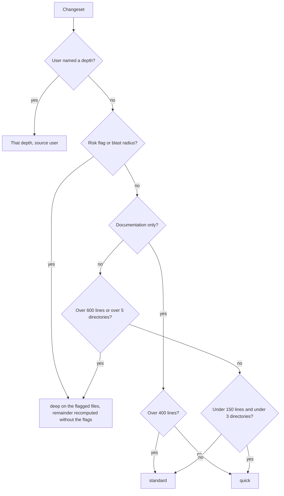

# review-depth

Match review effort to what the change is worth. This skill runs **before**
[`house-review`](../house-review/SKILL.md) and decides one thing: how hard to look. It then hands
that decision to `house-review`, which does the actual reviewing.

It exists because effort was the one review parameter nothing set. `house-review` already bounds
*how much it reads* against the diff stat, but a one-line typo fix and a 900-line change across
`scripts/`, `tests/`, and a contract directory otherwise get the same treatment. That produces one of
two failures, and which one depends on the reviewer's mood rather than on the change: small changes
get over-reviewed until the author learns to skim reviews, or large risky ones get under-reviewed,
which is the failure that costs something.

**It selects; it does not review.** The rubric categories and the `blocker` / `major` / `minor` /
`nit` severities live in the [`review-quality`](../../rules/review-quality.md) lens, and the review
procedure lives in `house-review`. Nothing here restates either. Depth changes how much is read and
how exhaustively the rubric is swept. It never changes what a finding is or what proof it needs.

## When to use

- Before any `house-review` run where the size or risk of the change is not obvious at a glance.
- When the user asks how carefully something should be reviewed, or whether a change is worth a full
  review.
- When reviewing a whole branch, a backlog of commits, or a batch of agent worktrees, where the
  changesets differ enough that one effort setting is wrong for most of them.
- When the user names a depth ("quick look at this", "deep review please"). Detection is skipped, but
  running this skill still records the signals, so an override that was a mistake is visible.

## When not to use

- To review anything. That is `house-review`. This skill stops at the selection block and the handoff.
- To decide whether a change should be reviewed at all. Every change is reviewed; `quick` is the floor,
  not "skip it".
- To gate a merge. A depth is not a verdict. Verdicts come from `house-review` findings, and readiness
  from [`spec-plan-readiness`](../spec-plan-readiness/SKILL.md) or
  [`verifier-agent`](../verifier-agent/SKILL.md).

## Inputs

Required:

- **A changeset**, computed exactly as `house-review` Step 1 computes it (branch against its
  merge-base with the default branch, with a working-tree fallback). Do not invent a second
  definition of "this change": the two skills must review the same thing.

Optional:

- **An explicit depth** from the user (`quick`, `standard`, or `deep`). When present it wins outright.
- **An explicit path scope** from the user. That is the user pre-bounding the review, so compute the
  signals over the scoped paths only, and say that the scope was applied.

## Procedure

### 1. Take an explicit depth if there is one

If the user named a depth, that is the depth. Set `source: user` and continue to the signal table
anyway: the signals still get computed and reported, because an override that disagrees with them is
worth one line of output. Never argue with the choice and never silently escalate it.

**When detection would have escalated, name the files it would have escalated on.** Report them as
`detected_anchors` alongside `detected_depth`. A user who asks for a quick look at a change touching
an installer and a contract is entitled to know which two files those were; dropping that list is the
one way an honoured override can still mislead. This is information, not an argument: the depth stays
what the user asked for.

### 2. Compute the changeset and subtract what is not reviewable

Compute the changeset per `house-review` Step 1, then subtract the material that step already
excludes from reading (lockfiles, generated code, vendored trees, minified assets, large fixture
data). Those exclusion classes are defined there, not here, so there is one copy of them.

Two mechanics decide whether the count is reproducible, and both have to be stated:

- **Pin rename detection on**: `git diff --numstat -M`. Without `-M` a moved file counts as a full
  delete plus a full add, so the same commit measures differently depending on a git config setting
  rather than on its content. A pure move contributes only its content change.
- **Count untracked files too.** `git diff` cannot see a file git does not track, so a working-tree
  changeset made entirely of new files measures as zero. Add each untracked file's full line count as
  added lines, and its directory to the spread. This is the same blind spot that once let
  `reconcile-worktrees` drop every new file an agent created while reporting success.

**Record every path you excluded.** The class boundary is a judgment call for an unusual file, and
recording the call is what makes a rerun comparable. What remains is the **reviewable set**, and
every signal below is computed over it, before any threshold is applied. Exclusion is not a tidying
step: in one real refactor it took the count from 6512 lines to 655, because a `uv.lock` update was
90 percent of the diff.

**Generated material is often not obvious from the path.** In that same repository, four
`schemas/*.schema.json` files totalling 938 lines are produced by a sibling script from the Pydantic
models beside them, which you can only learn by reading the repository. Extension and directory are a
first pass, not the answer. When a large file looks suspiciously regular, check whether something in
the repository writes it.

**An empty reviewable set is a computation failure, not a small change.** If the changeset resolved
but nothing reviewable came out of it, stop and take the fallback in Step 4 rather than reporting a
table of zeroes: every threshold below is satisfied by zero, so an empty set otherwise selects the
cheapest possible review for a change nobody measured.

### 3. Compute the signal table

Five signals, all over the reviewable set:

| Signal | Definition |
|---|---|
| `reviewable_lines` | Added plus deleted lines across the reviewable set (`git diff --numstat -M` over the range, plus each untracked file's full length, summed after exclusion). |
| `directories` | Count of distinct parent directories holding at least one reviewable changed file. Full paths, so two sibling directories count as two. The repository root counts as one. |
| `risk_flags` | Reviewable changed files falling in the trust-boundary classes `house-review` Step 2 orders first. Detect them by path and by diff content, and list the files that hit, with which class. |
| `blast_radius` | Reviewable changed files whose surface other code depends on. Two tests, and a file qualifies on either: it is **a named kind** (an approved contract, a schema, a persisted format, a CI workflow, an installer or build script, a shipped template, or a rules module other files compose), or it is **executable material referenced by 5 or more other files** (count with a tracked-file search such as `git grep -l`, never a plain recursive grep: in a real repository the recursive form walks the virtualenv, the build output, and every ignored directory, and one did not finish in two minutes where `git grep` answered in under a second). The reference count applies to executable material only, never to prose: see the note below. List the files that hit, with the reason. |
| `documentation_only` | True when every reviewable changed file is prose that *describes* the system (for example a README, a guide, a changelog) and no other file changed. False when any changed file is prose the system *runs*: a skill body, an agent prompt, a template, a scaffolded rules module. Those are executable artifacts that happen to be markdown, and a defect in one behaves like a defect in code. False for an empty reviewable set. |

`risk_flags` and `blast_radius` are lists, not booleans, because the entries are the evidence for the
depth that follows. An empty list is a real result and is reported as empty.

**Why the reference count excludes prose.** A widely linked document is not a widely depended-on
surface. In this repository `docs/CATALOG.md` is referenced by 19 files and `CONTRIBUTING.md` by 6,
so counting references over prose sent a four-line wording fix to `deep` on its first real run.
Editing a document that many files link to breaks nothing; editing a module that many files import
does. Prose reaches `blast_radius` only by being one of the named kinds, where the reason is what the
document governs rather than how often it is cited.

### 4. Apply the selection rule

Ordered, first match wins, so one signal table yields exactly one depth:

| # | Condition | Depth |
|---|---|---|
| R1 | The user named a depth | that depth, `source: user` |
| R2 | `risk_flags` or `blast_radius` is non-empty | `deep`, anchored (see below) |
| R3 | `documentation_only` and `reviewable_lines` <= 400 | `quick` |
| R4 | `documentation_only` and `reviewable_lines` > 400 | `standard` |
| R5 | `reviewable_lines` > 600 or `directories` > 5 | `deep` |
| R6 | `reviewable_lines` <= 150 and `directories` <= 2 | `quick` |
| R7 | Anything else | `standard` |



**R2 escalates the flagged files, not automatically the whole changeset.** When R2 fires, the flagged
files are the `deep_anchors` and get `deep`. The **remainder** is the reviewable set minus the
anchors, named that way because "everything else" is a list the reviewer should not have to
reconstruct on a sixty-file change. It takes the `remainder_depth`: the depth R3 through R7 select
when the same signal table is re-read with `risk_flags` and `blast_radius` empty. Both numbers come
from the stated rules, so the pair is as reproducible as a single depth would be, and `house-review`
Step 2 already orders a bounded read by risk, so this is that instruction given a number rather than
a new mechanism.

Blanket escalation was the first draft and the dogfood killed it: four of six real changesets tripped
R2, usually on one CI workflow or one contract inside an otherwise ordinary change, and a `deep` that
fires on two thirds of commits is just the uniform effort setting this skill exists to replace. Under
the anchored rule, a commit that adds a code of conduct and edits ten lines of CI gets a deep read of
the workflow and a `standard` read of the prose, instead of a full sweep of 400 lines of policy text.

Three orderings in that table are deliberate.

**R2 before R3.** A change can be documentation-only by file type and high blast radius by meaning.
An approved contract under a `docs/spec/` directory is a markdown file, and editing one changes what
the code is required to do. Checking risk first is what stops a contract edit from being waved
through as a docs change.

**R2 before R5.** A small change to a trust boundary outranks a large change to inert code. Size is
the weakest of the five signals and it is checked last for that reason.

**R4 exists because volume is its own risk.** A documentation change large enough to cross 400 lines
is rewriting something rather than correcting it, and a rewrite can be wrong in ways a correction
cannot. `quick` is the right floor for a typo fix, not for a new guide.

**When a signal cannot be computed** (no git history, an unreadable range, a diff that will not
resolve, or a reviewable set that came out empty), do not guess and do not fall through to `quick`.
Select `standard`, say which signal was unavailable, and say that the fallback fired. An unmeasurable
change is not a cheap one.

### 5. Report the selection, then review at that depth

Emit the output block below, then run [`house-review`](../house-review/SKILL.md) with the selected
depth applied to the three knobs in the next section. When R2 fired, that means the anchors at `deep`
and the rest of the changeset at `remainder_depth`, which is `house-review` Step 2's risk ordering
carried out with the priority already decided.

**Carry the changeset identity across, not just the depth.** The block names the range (or the
working tree) the signals were computed over, and `house-review` reviews that same range rather than
recomputing one of its own. Two skills each resolving "this change" independently is how a depth ends
up describing a different diff than the review it governs.

**Depth orders the budget; it never overrides it.** A selected depth is effort per file, not a
promise that everything fits. When even the cheapest depth over the reviewable set exceeds what can
be read, `house-review` Step 2's bounding rule wins and its coverage statement is mandatory: say what
was not read. A scaffold commit of 2521 reviewable lines across 16 directories selects `deep` here
and still cannot be read in full, and the honest output is a `deep` review of the anchors with the
remainder named as unread.

The selection block belongs in the output even when the answer is boring: it is what makes the effort
spent inspectable, and what lets a second run be compared to the first.

## What each depth means

Depth sets three knobs that `house-review` already exposes. It sets nothing else.

| Knob | `quick` | `standard` | `deep` |
|---|---|---|---|
| **How much is read** | The changed hunks plus enough surrounding context to judge them fairly. | `house-review`'s default: the changed files with their surrounding context, ordered by risk. | The changed files in full, plus their tests and their immediate callers or dependents. |
| **How the rubric is swept** | Only the categories the change plainly warrants. | As the lens directs, applied where the diff warrants. | Every category in the lens considered explicitly, each recorded as applied or as one line of "not applicable, and why". |
| **What gets written down** | `blocker` and `major`. A `minor` or `nit` only when stating it costs nothing. | All four severities. | All four, plus the categories that were checked and found clean, so the absence of a finding is evidence rather than silence. |

Four things are identical at every depth, and no depth may weaken them:

- **Report-only.** No depth edits or commits anything.
- **Validate before reporting.** A `quick` review is a smaller read, never a lower standard of proof.
  The lens's govern step applies unchanged, and an unsubstantiated finding is dropped at every depth.
- **The severity definitions.** They are the lens's. `quick` raises the reporting floor; it does not
  redefine what a `blocker` is.
- **Coverage honesty.** If the read was bounded, the verdict line says what was not read, exactly as
  `house-review` Step 2 requires. This matters most at `quick`, where the reader is likeliest to
  mistake a bounded review for a complete one.

## Output format

Return this block before the review, with fields in this order:

```text
depth: quick | standard | deep
source: detected | user
changeset: the range the signals were computed over, or "working tree"
rule: the identifier and text of the rule that fired, for example "R2: risk_flags non-empty"
signals:
  reviewable_lines: N
  directories: N
  risk_flags: [file: class, ...]
  blast_radius: [file: reason, ...]
  documentation_only: true | false
excluded: [path: class, ...]
deep_anchors: [file, ...]        # only when R2 fired: the files reviewed at deep
remainder_depth: quick | standard | deep   # only when R2 fired: everything else
detected_depth: ...              # only when source is user and detection disagreed
detected_anchors: [file, ...]    # with detected_depth, when detection would have fired R2
fallback: ...                    # only when a signal could not be computed: which one, and that standard was selected
```

Rules:

- `rule` names exactly one rule. If two conditions were true, the earlier one fired and it is the one
  reported.
- `deep_anchors` and `remainder_depth` appear together or not at all, and only under R2. The
  remainder value names the rule it came from too, so both halves of the decision are traceable.
- `risk_flags`, `blast_radius`, and `excluded` list every hit with its reason. An empty list is
  reported as empty rather than omitted.
- `detected_depth` appears only when the user's choice and detection disagree, and it never overrides
  anything. It is one line so the disagreement is visible later. When detection would have fired R2,
  `detected_anchors` comes with it, because the files it would have escalated on are the part of the
  disagreement worth knowing.
- The same changeset and the same exclusion calls must produce the same block. If a rerun differs,
  the difference is in the exclusions or the flags, which is why both are listed.

## Notes

- **Determinism has a boundary, and it is stated rather than papered over.** Line counts, directory
  counts, and file-type checks are mechanical. Whether an unusual file is generated or vendored, and
  whether a symbol is a public surface, are judgment. The skill gets reproducibility by recording
  those calls, not by pretending they were not made.
- **The thresholds are defaults, not laws.** 150, 400, 600, 5 directories, and 5 referencing files
  are starting numbers, chosen to be crossed rather than admired. Retune them in this file if a
  repository's changes cluster differently; the point of writing them as numbers is that retuning is
  a visible edit rather than a mood.
- **The two prose carve-outs came from real runs, not from theory.** A repository whose deliverable
  is markdown breaks the naive version of both `documentation_only` and `blast_radius`, and this kit
  is one: its skills are prose the system runs, and its most-linked documents are the ones safest to
  edit. Every signal that talks about prose is written for that case, because it is where the naive
  rule failed first.
- **`quick` is a floor, not a skip.** The cheapest outcome this skill can select is still a review.
- **Exercised outside this kit.** The exclusion rule and the size floor had never fired on this
  repository's own history, which has no lockfiles and no thousand-line commits. Both fired against
  an external Python repository, and that is where the reference-count search, the generated-schema
  exclusion, and the budget interaction surfaced. The thresholds themselves needed no change there,
  which is worth more than a recalibration would have been.
- Composition, not duplication: the rubric and severities are in
  [`review-quality`](../../rules/review-quality.md), the exclusion classes and the changeset logic
  are in [`house-review`](../house-review/SKILL.md), and this skill holds only the signals and the
  selection rule.
- Future direction (not built): `house-review` names a multi-lens deep review that would run several
  lenses and reconcile their findings. If that is built, `deep` is where it plugs in, and the
  selection rule above is what would decide when it runs.

## Conventions

Follow the repo's house-style module (in this kit,
[`.agents/rules/house-style.md`](../../rules/house-style.md)): sentence-case headings, clickable
relative links, named sources, no em-dashes. That file is a swappable default; a downstream adopter
may replace it without touching this skill. This governs the selection block's wording. It does not
govern the change being reviewed, which belongs to its own repository and is read-only here.
