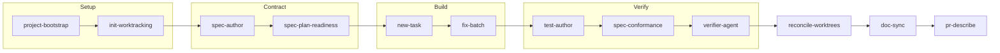

# Zen Starter Kit

[](LICENSE)

The Zen Starter Kit is a portable library of reusable AI agent skills and the tooling to distribute them across coding harnesses. It packages repeatable workflows for project setup, work tracking, specification authoring, test authoring, parallel agent execution, verification, documentation, code review, and pull request preparation.

The core principle is **write a skill once, use it in every harness**. Each skill has one harness-agnostic source file, `SKILL.md`. The kit then installs that source where a supported tool can discover it or generates a thin, native adapter for the target project.

## Why this repository exists

AI coding tools are useful, but their workflows are often difficult to reproduce across tools and projects. This repository provides a shared layer for procedures that should be:

- **Portable:** the procedure does not depend on one vendor's agent runtime.
- **Self-contained:** a skill explains what it does, when to use it, and how to complete it.
- **Verifiable:** skills prefer concrete files, commands, acceptance criteria, and checks.
- **Composable:** the skills can be used independently or chained into a development workflow.

This is a skills library, not an application or a service. It has no database, network service, or third-party Python dependency.

## What's included

- [`.agents/skills/`](.agents/skills/): the canonical skills, one directory per skill.
- [`scripts/install.py`](scripts/install.py): installs skills, and the rules module they compose, for Claude Code and OpenCode.
- [`scripts/build-adapters.py`](scripts/build-adapters.py): generates Cursor rules and VS Code or Copilot prompts for a target project, rewriting each skill's relative links so they resolve from the adapter's location.
- [`scripts/validate-skills.py`](scripts/validate-skills.py): checks skill frontmatter, names, descriptions, and body length, plus unresolved relative links, references to sibling skills that do not exist, links that escape the shipped skill tree, and skills that claim both draft and shipped status.
- [`AGENTS.md`](AGENTS.md): the canonical repository instructions and agent reading protocol.
- [`docs/GETTING-STARTED.md`](docs/GETTING-STARTED.md): a plain-language guide for founders and builders starting new or existing projects.
- [`docs/ARCHITECTURE.md`](docs/ARCHITECTURE.md): the technical model, components, and maintenance flow.
- [`docs/CATALOG.md`](docs/CATALOG.md): the reader-facing catalog, including shipped, draft, and planned skills.
- [`docs/PROJECT-STATUS.md`](docs/PROJECT-STATUS.md): a partner-facing snapshot of where the kit stands.
- [`docs/PLATFORM-PITCH.md`](docs/PLATFORM-PITCH.md): the wider Zen Solutions platform vision.
- [`docs/spec/`](docs/spec/): behavioral specifications, the contracts the spine's skills are built and verified against.
- [`ROADMAP.md`](ROADMAP.md): the builder-facing execution plan.
- [`.tasks/`](.tasks/): atomic work items used to build and maintain this kit.
- [`tests/`](tests/): the kit's own test suite, derived from the specifications under `docs/spec/`.

## How the workflow fits together

The skills can form one development spine, while remaining useful on their own:



The front door scaffolds a project and its work tracker. A rough idea becomes a written specification, which is gated for readiness before any code is written. The approved specification is decomposed into atomic tasks, independent tasks can be dispatched to isolated agents, tests are derived from the specification's scenarios, and the implementation is audited against the contract. A final independent verification runs the declared commands and returns a pass, fail, or blocked verdict with evidence, and only then is the work reconciled. After it lands, `doc-sync` detects which documents the change invalidated, and the result is documented for review.

Three report-only lenses are composed by the skills above rather than run on their own: `spec-quality` (specification well-formedness), `test-quality` (test design), and `review-quality` (code review). See the [skill catalog](docs/CATALOG.md) for the complete inventory and status of each skill.

## Prerequisites

- Python 3.9 or newer.
- One or more supported AI coding tools, depending on the integration you choose.
- A project where you want to use the skills. The kit itself can also be used as a dogfooding example.

Check the Python version before installing:

```bash
python --version
```

On systems where Python is exposed as `python3`, use `python3` in the commands below.

## Quick start

### 1. Get the kit

Clone the repository and enter its directory:

```bash
git clone https://github.com/hams-ollo/zen-starter-kit.git
cd zen-starter-kit
```

### 2. Review the installation plan

The dry run makes no changes. It shows which skills would be installed and where:

```bash
python scripts/install.py --dry-run
```

### 3. Install global skills

Install the default tool set, Claude Code and OpenCode:

```bash
python scripts/install.py
```

The installer is idempotent, so it is safe to run again after the kit changes. On Windows it uses directory copies by default. On macOS and Linux it uses directory symlinks by default.

Install for only one supported tool when needed:

```bash
python scripts/install.py --tools claude
python scripts/install.py --tools opencode
```

The installer writes its copy-mode manifest to `scripts/.install-manifest.json` so it can recognize and update files it previously created. It reports a conflict instead of overwriting an unmanaged file.

### 4. Generate project-level adapters

Cursor and VS Code or Copilot use project-level configuration in this kit. Generate adapters into the project where you want to use the skills:

```bash
python scripts/build-adapters.py --target cursor,vscode --out ../my-project
```

This creates:

- `.cursor/rules/<skill-name>.mdc` for Cursor.
- `.github/prompts/<skill-name>.prompt.md` for VS Code or Copilot.
- `.agents/rules/` and `.agents/skills/<skill-name>/`, holding the material those adapters link to: the swappable rules module (the review rubric, the house style) and each skill's own templates. The adapters' relative links are rewritten to point here, so a lens reference resolves in the target project instead of dangling. An `.agents/rules/` file that already exists is never overwritten, because that module is swappable and the project's own copy outranks the kit's.

Generated adapters are derived files. Edit the source [`SKILL.md`](.agents/skills/) under `.agents/skills/`, then regenerate the adapters. A generation run overwrites the adapter files it owns.

### 5. Use a skill

Ask the installed harness to use a skill by name, or select the generated rule or prompt in the target project. Begin with a workflow skill such as `project-bootstrap`, `init-worktracking`, or `new-task`. Read the skill's `SKILL.md` when you need the complete procedure and acceptance criteria.

## Integration details

| Harness | Integration | Command or location |
|---|---|---|
| Claude Code | Global skill discovery | `python scripts/install.py --tools claude` |
| OpenCode | Global skill discovery | `python scripts/install.py --tools opencode` |
| Cursor | Project rule adapter | `python scripts/build-adapters.py --target cursor --out <project>` |
| VS Code or Copilot | Project prompt adapter | `python scripts/build-adapters.py --target vscode --out <project>` |
| Other harnesses | Read the canonical skill manually or add a local adapter | [`.agents/skills/`](.agents/skills/) |

The kit does not maintain separate hand-edited versions of a skill for each harness. The canonical source remains the `SKILL.md` file.

## Repository layout

| Path | Purpose |
|---|---|
| [`.agents/skills/`](.agents/skills/) | Canonical, reusable skills |
| [`.agents/rules/house-style.md`](.agents/rules/house-style.md) | Swappable writing and formatting rules used by skills |
| [`scripts/`](scripts/) | Installer, adapter generator, and validation tooling |
| [`.tasks/`](.tasks/) | Atomic work items for maintaining the kit |
| [`tests/`](tests/) | The kit's own test suite |
| [`AGENTS.md`](AGENTS.md) | Canonical instructions for agents working in this repository |
| [`docs/ARCHITECTURE.md`](docs/ARCHITECTURE.md) | Technical architecture and skill maintenance flow |
| [`docs/CATALOG.md`](docs/CATALOG.md) | Narrative catalog for readers |
| [`docs/spec/`](docs/spec/) | Behavioral specifications and conformance reports |
| [`docs/PROJECT-STATUS.md`](docs/PROJECT-STATUS.md) | Partner-facing status snapshot |
| [`docs/PLATFORM-PITCH.md`](docs/PLATFORM-PITCH.md) | Platform vision and positioning |
| [`ROADMAP.md`](ROADMAP.md) | Ordered plan for future work |
| [`CHANGELOG.md`](CHANGELOG.md) | Record of completed work |

## Validate changes

Run the skill linter from the repository root:

```bash
python scripts/validate-skills.py
```

Run the kit's own test suite:

```bash
python -m unittest discover -s tests -p "test_*.py"
```

Check the work-tracking backlog for structural integrity:

```bash
python .tasks/validate.py --strict
```

Preview adapter generation without writing files:

```bash
python scripts/build-adapters.py --dry-run
```

Preview installation for a specific test home without touching your normal tool directories:

```bash
python scripts/install.py --dry-run --home ./.tmp/zen-home
```

The scripts and the test suite use only the Python standard library, so there is no package installation step. The suite under [`tests/`](tests/) covers the kit's own tooling, derived from the specifications in [`docs/spec/`](docs/spec/); the kit has no runtime application to test.

## Uninstall

Remove the targets recorded by the installer:

```bash
python scripts/install.py --uninstall --dry-run
python scripts/install.py --uninstall
```

If you installed with `--home`, provide the same `--home` value when uninstalling. Generated Cursor and VS Code or Copilot adapters are project files and should be removed from the target project through its normal version-control workflow.

## For agents working in this repository

Start with [`AGENTS.md`](AGENTS.md). It is the canonical instruction file. For an assigned task, follow its low-context reading protocol:

1. Read `AGENTS.md` in full.
2. Read the assigned task file in `.tasks/`.
3. Read only the files named by that task's `touched_files` metadata or body.

When adding or changing a skill, keep its logic in `.agents/skills/<name>/SKILL.md`, run the validator, and update the catalog or roadmap when the skill's status changes. A skill is considered shipped only after it has been used, iterated on, and verified on real work.

## For contributors

Before opening a change:

1. Read [`AGENTS.md`](AGENTS.md) and the relevant task or roadmap entry.
2. Keep changes focused and preserve the single-source-of-truth model.
3. Run [`scripts/validate-skills.py`](scripts/validate-skills.py) and any relevant dry-run commands.
4. Update documentation when commands, supported harnesses, or repository structure change.

For writing conventions, use the swappable [house-style rules](.agents/rules/house-style.md). For the current scope and planned work, consult the [roadmap](ROADMAP.md).

## Troubleshooting

### The installer reports a conflict

The installer found a file or directory at a target path that it did not create. Move it, remove it, or choose a different home directory, then rerun the command. The installer does not overwrite unmanaged targets.

### Symlink creation fails on Windows

Use the default Windows copy mode, or force it explicitly:

```bash
python scripts/install.py --mode copy
```

### A generated adapter is out of date

Regenerate it from the kit root. Do not edit the generated file directly:

```bash
python scripts/build-adapters.py --target cursor,vscode --out ../my-project
```

### A skill is not discovered

Confirm that the skill has a `SKILL.md`, run the validator, and verify that you installed the correct integration for your harness. Claude Code and OpenCode use `install.py`; Cursor and VS Code or Copilot use `build-adapters.py`.

## Security and trust

Review a skill before installing it into an AI coding tool. Skills are instructions that influence agent behavior and may cause file or command changes when invoked. Use the same review standard you would apply to source code, especially for skills obtained from outside this repository.

## License

This project is available under the [MIT License](LICENSE).
