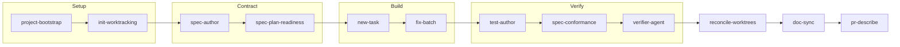

# Zen Agent Skills

[](LICENSE)

**AI writes code faster than anyone can review it.** The usual response is to read every line, which turns the reviewer into the bottleneck and caps the size of what a team can take on at its own reading speed.

Zen Agent Skills moves the rigor to the two places it compounds instead: a written contract before the work, and independent verification with evidence after it. It is a portable library of agent skills, one harness-agnostic `SKILL.md` per skill, that installs into Claude Code, OpenCode, Cursor, and VS Code or Copilot from a single source.

This is a skills library, not a framework or an agent runtime. There is no process your agent has to run inside, no database, no service, and no third-party Python dependency.

## Proof, not assertion

Most agent workflows report success. This one reports what it can actually substantiate, and refuses to report anything else.

[`verifier-agent`](.agents/skills/verifier-agent/SKILL.md) runs before work lands. It executes the declared commands, audits the implementation against its contract, and returns `pass`, `fail`, or `blocked`. That third verdict is the point: when verification *cannot* run honestly, it says so rather than guessing. Here is a real one from this repository on 2026-07-27, not an illustration:

```text
verdict: blocked
blocking_reasons:
  - reason: the supplied contract is not approved
    detail: docs/spec/house-review.md carries `status: draft`. A draft spec is one no human
      has agreed to, so verifying against it would launder an unapproved contract into evidence.
commands:
  - not executed. A blocked run reports no pass or fail for the work itself, so no
    verification command was run and none is reported.
```

That contract has since been approved, so the same run today would proceed to a verdict on the work itself. The record is dated for exactly that reason: it states what was true when it ran, rather than being quietly updated to match the tree. The full record, including why the trigger was genuine rather than staged, is at [`docs/spec/house-review.verification.md`](docs/spec/house-review.verification.md).

The same discipline runs through the kit. [`spec-plan-readiness`](.agents/skills/spec-plan-readiness/SKILL.md) blocks implementation until a spec and its task decomposition are provably implementable. [`spec-conformance`](.agents/skills/spec-conformance/SKILL.md) produces a positive matrix of what conformed, what diverged, and what was never built, rather than an assurance. [`doc-sync`](.agents/skills/doc-sync/SKILL.md) checks reader-facing prose against repository facts and defaults to a dry run. Coverage is stated honestly where it is partial: `tracker-links` is recorded at two of seven scenarios verified, because that is what was verified.

## No skill ships cold

A skill is accepted here only after it has been used on real work and refined from what that use exposed. A well-written skill for a workflow nobody has performed is parked in [`ROADMAP.md`](ROADMAP.md) rather than merged.

That rule is why the catalog is smaller than it could be, and it is the most common reason a contribution is declined. It is also why the verification records above exist at all.

## Where to start

Pick the row that matches you. Each path is short, and none of them require reading the others.

| You are | Start here |
|---|---|
| New to agent workflows, or not a developer by trade | [`docs/GETTING-STARTED.md`](docs/GETTING-STARTED.md): a plain-language walkthrough with prompts you can copy |
| A developer who just wants it installed | [Quick start](#quick-start) below, about five minutes |
| Deciding whether this is worth adopting | [`docs/CATALOG.md`](docs/CATALOG.md) for what each skill does, then [`docs/ARCHITECTURE.md`](docs/ARCHITECTURE.md) for how it stays portable |
| An AI agent asked to work **on this repository** | [`AGENTS.md`](AGENTS.md) in full, then your assigned task file. It defines the reading protocol and the contribution bar |
| An AI agent asked to **use one of these skills** | That skill's own `SKILL.md` under [`.agents/skills/`](.agents/skills/). Each is self-contained: what it does, when not to use it, the procedure, and how to tell it worked |

## How the workflow fits together

The skills form one development spine, while remaining useful on their own:



The front door scaffolds a project and its work tracker. A rough idea becomes a written specification, which is gated for readiness before any code is written. The approved specification is decomposed into atomic tasks, independent tasks can be dispatched to isolated agents, tests are derived from the specification's scenarios, and the implementation is audited against the contract. A final independent verification runs the declared commands and returns a pass, fail, or blocked verdict with evidence, and only then is the work reconciled. After it lands, `doc-sync` detects which documents the change invalidated, and the result is documented for review.

Three report-only lenses are composed by the skills above rather than run on their own: `spec-quality` (specification well-formedness), `test-quality` (test design), and `review-quality` (code review). See [`docs/CATALOG.md`](docs/CATALOG.md) for the complete inventory and the status of each skill.

## Quick start

Requires Python 3.11 or newer. The floor and the newest release are both exercised by CI on Linux, macOS, and Windows; the kit does not claim a version it does not test.

```bash
git clone https://github.com/hams-ollo/zen-agent-skills.git
cd zen-agent-skills
```

Preview what would be installed and where. The dry run makes no changes:

```bash
python scripts/install.py --dry-run
```

Install the default skill set for Claude Code and OpenCode:

```bash
python scripts/install.py
```

The installer is idempotent, reports a conflict instead of overwriting a file it does not manage, and is reversed with `--uninstall`.

Then ask your harness to use a skill by name. Start with `project-bootstrap`, `init-worktracking`, or `new-task`.

Cursor and VS Code or Copilot use project-level adapters instead of global discovery, and there are narrower installation profiles for keeping the description budget small. Both are covered in [`docs/INSTALL.md`](docs/INSTALL.md), along with uninstall and troubleshooting.

## Connecting it to an issue tracker

The spine is local by default: a task file lives in your repository, not in a tracker, which is what keeps an agent's context small and lets the whole system work offline. When a team needs the work visible on a board, a task can name the GitHub issue it serves with an `external` field (`#123`, or `owner/repo#123` for another repository). [`pr-describe`](.agents/skills/pr-describe/SKILL.md) then puts a closing reference in the pull request description, so merging closes the issue without anyone remembering to.

The point is not the plumbing, which is one line of text. It is that GitHub's rules for that line fail silently in four different ways: a keyword is ignored in a pull request title and in comments, it is ignored entirely unless the pull request targets the default branch, and one keyword followed by a list closes only the first issue. Each of those produces a pull request that looks right, merges cleanly, and leaves the tracker wrong. `pr-describe` knows all four. See [`docs/ISSUE-LINKING.md`](docs/ISSUE-LINKING.md) for setup, or [`docs/spec/tracker-links.md`](docs/spec/tracker-links.md) for the contract.

## Repository layout

| Path | Purpose |
|---|---|
| [`.agents/skills/`](.agents/skills/) | Canonical, reusable skills. One directory per skill, each with a harness-agnostic `SKILL.md` |
| [`.agents/rules/`](.agents/rules/) | The two swappable lenses skills compose: [`house-style.md`](.agents/rules/house-style.md) for writing and formatting, [`review-quality.md`](.agents/rules/review-quality.md) for the review rubric and severities. Installed alongside the skills, because a skill that references a lens is not self-contained without it |
| [`scripts/`](scripts/) | [`install.py`](scripts/install.py) (cross-platform installer), [`build-adapters.py`](scripts/build-adapters.py) (Cursor and VS Code adapters), [`validate-skills.py`](scripts/validate-skills.py) (kit-level lint) |
| [`.tasks/`](.tasks/) | Atomic work items for maintaining the kit, plus their validator |
| [`tests/`](tests/) | The kit's own test suite, derived from the specifications under `docs/spec/` |
| [`docs/spec/`](docs/spec/) | Behavioral specifications, plus the conformance, verification, readiness, and characterization records that sit beside them |
| [`AGENTS.md`](AGENTS.md) | Canonical instructions for agents working in this repository |
| [`ROADMAP.md`](ROADMAP.md) | Ordered plan for future work |
| [`CHANGELOG.md`](CHANGELOG.md) | Record of completed work |
| [`CONTRIBUTING.md`](CONTRIBUTING.md) | How to contribute, and the bar a new skill has to clear |
| [`SECURITY.md`](SECURITY.md) | Threat model and how to report a security issue privately |

Write once, adapt thin: a skill's logic lives only in its `SKILL.md`. Per-harness files are generated by [`scripts/build-adapters.py`](scripts/build-adapters.py) and never hand-maintained in parallel. See [`docs/ARCHITECTURE.md`](docs/ARCHITECTURE.md) for the full model.

## Security and trust

A skill is not a library your code calls in a sandbox. It is prose an agent reads and acts on, in your repository, usually with permission to write files and run commands. Review one before installing it, with the same standard you would apply to a script you were about to run, and especially for skills obtained from outside this repository.

Each `SKILL.md` is a single readable file with no indirection, which is deliberate: it is what makes that review possible.

To report a security issue, follow [`SECURITY.md`](SECURITY.md). Please do not open a public issue for it.

## How this relates to adjacent projects

The nearest projects by function are `obra/superpowers`, which packages a parallel subagent development lifecycle, and GitHub's Spec Kit (`github/spec-kit`), which drives a specify, plan, tasks, implement loop. This repository is a library of portable skills plus the tooling to distribute them across harnesses, so there is no framework and no runtime to adopt. Its distinguishing property is the evidence discipline described above: no skill ships without having been used on real work, a verification is recorded with the evidence behind it, and coverage is stated honestly rather than implied.

## Contributing

See [`CONTRIBUTING.md`](CONTRIBUTING.md) for the full guide and the checks to run before opening a change. Read the [no skill ships cold](#no-skill-ships-cold) rule first.

## License

This project is available under the [MIT License](LICENSE).
