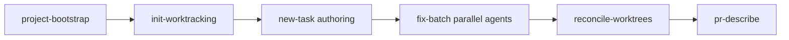

# Zen Starter Kit

A portable, cross-harness library of AI agent **skills**, plus the tooling to install them into any project and any AI coding tool. Built by Zen Solutions for its own work, and shared so other founders and builders can plug the same workflows into Claude Code, Cursor, VS Code (Copilot), Codex, and OpenCode.

The design goal is simple: **write a skill once, use it in every harness.** [`AGENTS.md`](AGENTS.md) is the canonical instruction file (an open standard read natively by Cursor, Codex, Copilot, Gemini CLI, and more), and each skill's body lives in a single harness-agnostic `SKILL.md`.

## What is a skill?

A skill is a packaged, reusable procedure an AI agent can invoke, for example "scaffold a work-tracking system into this repo" or "turn a rough idea into a verifiable, agent-ready task file." Each one is a directory under [`.agents/skills/`](.agents/skills/) with a `SKILL.md` describing what it does, when to use it, and how.

## The workflow spine

The skills are designed to chain into one development spine:



A project baseline is scaffolded, work tracking is brought up, an idea becomes a decomposed, verifiable task file, parallel agents execute, their work is reconciled back into the main tree, and the change is written up as a PR. See [`docs/CATALOG.md`](docs/CATALOG.md) for the full catalog and what is shipped versus planned.

## Install

The installer links the kit's skills into your tools' discovery directories. It is idempotent and safe to re-run, previews with `--dry-run`, and cleanly reverses with `--uninstall`.

```bash
python scripts/install.py --dry-run
```

```bash
python scripts/install.py
```

On Windows the default link mode is `copy` (POSIX symlinks are fragile there); on macOS and Linux it is `symlink`. See [`scripts/install.py`](scripts/install.py) for options.

## Make it your own

The writing and formatting conventions the skills assume live in one swappable file, [`.agents/rules/house-style.md`](.agents/rules/house-style.md). Keep it, empty it, or replace it with your own voice. The skills reference that file rather than hardcoding any rule, so adopting the kit never forces someone else's style on your projects.

## License

[MIT](LICENSE). Use it, fork it, share it.
