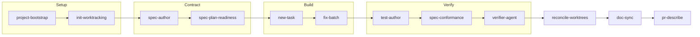

# Zen Agent Skills

[](LICENSE)

Zen Agent Skills is a portable library of reusable AI agent skills and the tooling to distribute them across coding harnesses. It packages repeatable workflows for project setup, work tracking, specification authoring, test authoring, parallel agent execution, verification, documentation, code review, and pull request preparation.

The core principle is **write a skill once, use it in every harness**. Each skill has one harness-agnostic source file, `SKILL.md`. The kit then installs that source where a supported tool can discover it or generates a thin, native adapter for the target project.

## Where to start

Pick the row that matches you. Each path is short, and none of them require reading the others.

| You are | Start here |
|---|---|
| New to agent workflows, or not a developer by trade | [`docs/GETTING-STARTED.md`](docs/GETTING-STARTED.md): a plain-language walkthrough with prompts you can copy |
| A developer who just wants it installed | [Quick start](#quick-start) below, about five minutes |
| Deciding whether this is worth adopting | [`docs/CATALOG.md`](docs/CATALOG.md) for what each skill does, then [`docs/ARCHITECTURE.md`](docs/ARCHITECTURE.md) for how it stays portable |
| An AI agent asked to work **on this repository** | [`AGENTS.md`](AGENTS.md) in full, then your assigned task file. It defines the reading protocol and the contribution bar |
| An AI agent asked to **use one of these skills** | That skill's own `SKILL.md` under [`.agents/skills/`](.agents/skills/). Each is self-contained: what it does, when not to use it, the procedure, and how to tell it worked |

## Why this repository exists

AI coding tools are useful, but their workflows are often difficult to reproduce across tools and projects. This repository provides a shared layer for procedures that should be:

- **Portable:** the procedure does not depend on one vendor's agent runtime.
- **Self-contained:** a skill explains what it does, when to use it, and how to complete it.
- **Verifiable:** skills prefer concrete files, commands, acceptance criteria, and checks.
- **Composable:** the skills can be used independently or chained into a development workflow.

This is a skills library, not an application or a service. It has no database, network service, or third-party Python dependency.

## What's included

- [`.agents/skills/`](.agents/skills/): the canonical skills, one directory per skill.
- [`scripts/install.py`](scripts/install.py): installs skills, and the rules module they compose, for Claude Code and OpenCode.
- [`scripts/build-adapters.py`](scripts/build-adapters.py): generates Cursor rules and VS Code or Copilot prompts for a target project, rewriting each skill's relative links so they resolve from the adapter's location.
- [`scripts/validate-skills.py`](scripts/validate-skills.py): checks skill frontmatter, names, descriptions, and body length, plus unresolved relative links, references to sibling skills that do not exist, links that escape the shipped skill tree, and skills that claim both draft and shipped status. A description over 1024 characters is an error, because that is the hard limit both target harnesses enforce on the field.
- [`AGENTS.md`](AGENTS.md): the canonical repository instructions and agent reading protocol.
- [`docs/GETTING-STARTED.md`](docs/GETTING-STARTED.md): a plain-language guide for founders and builders starting new or existing projects.
- [`docs/ARCHITECTURE.md`](docs/ARCHITECTURE.md): the technical model, components, and maintenance flow.
- [`docs/CATALOG.md`](docs/CATALOG.md): the reader-facing catalog of shipped and planned skills.
- [`docs/ISSUE-LINKING.md`](docs/ISSUE-LINKING.md): how to link tasks to GitHub issues so merging a pull request closes them.
- [`docs/spec/`](docs/spec/): behavioral specifications, the contracts the spine's skills are built and verified against.
- [`ROADMAP.md`](ROADMAP.md): the builder-facing execution plan.
- [`.tasks/`](.tasks/): atomic work items used to build and maintain this kit.
- [`tests/`](tests/): the kit's own test suite, derived from the specifications under `docs/spec/`.

## How the workflow fits together

The skills can form one development spine, while remaining useful on their own:



The front door scaffolds a project and its work tracker. A rough idea becomes a written specification, which is gated for readiness before any code is written. The approved specification is decomposed into atomic tasks, independent tasks can be dispatched to isolated agents, tests are derived from the specification's scenarios, and the implementation is audited against the contract. A final independent verification runs the declared commands and returns a pass, fail, or blocked verdict with evidence, and only then is the work reconciled. After it lands, `doc-sync` detects which documents the change invalidated, and the result is documented for review.

### Connecting it to an issue tracker

The spine is local by default: a task file lives in your repository, not in a tracker, which is what keeps an agent's context small and lets the whole system work offline. When a team needs the work visible on a board, a task can name the GitHub issue it serves with an `external` field (`#123`, or `owner/repo#123` for another repository). `pr-describe` then puts a closing reference in the pull request description, so merging closes the issue without anyone remembering to.

The point is not the plumbing, which is one line of text. It is that GitHub's rules for that line fail silently in four different ways: a keyword is ignored in a pull request title and in comments, it is ignored entirely unless the pull request targets the default branch, and one keyword followed by a list closes only the first issue. Each of those produces a pull request that looks right, merges cleanly, and leaves the tracker wrong. `pr-describe` knows all four. See [`docs/ISSUE-LINKING.md`](docs/ISSUE-LINKING.md) for how to set it up and what to check when an issue does not close, or [`docs/spec/tracker-links.md`](docs/spec/tracker-links.md) for the contract.

Other trackers use the same shape with a different token. Azure Boards support is on the [roadmap](ROADMAP.md), deliberately unbuilt until there is a board to exercise it against.

Three report-only lenses are composed by the skills above rather than run on their own: `spec-quality` (specification well-formedness), `test-quality` (test design), and `review-quality` (code review). See the [skill catalog](docs/CATALOG.md) for the complete inventory and status of each skill.

## Prerequisites

- Python 3.11 or newer. The floor and the newest release are both exercised by CI on Linux, macOS, and Windows; the kit does not claim a version it does not test.
- One or more supported AI coding tools, depending on the integration you choose.
- A project where you want to use the skills. The kit itself can also be used as a dogfooding example.

Check the Python version before installing:

```bash
python --version
```

On systems where Python is exposed as `python3`, use `python3` in the commands below.

## Quick start

### 1. Get the kit

Clone the repository and enter its directory:

```bash
git clone https://github.com/hams-ollo/zen-agent-skills.git
cd zen-agent-skills
```

### 2. Review the installation plan

The dry run makes no changes. It shows which skills would be installed and where:

```bash
python scripts/install.py --dry-run
```

### 3. Install global skills

Install the default tool set, Claude Code and OpenCode:

```bash
python scripts/install.py
```

The installer is idempotent, so it is safe to run again after the kit changes. On Windows it uses directory copies by default. On macOS and Linux it uses directory symlinks by default.

Install for only one supported tool when needed:

```bash
python scripts/install.py --tools claude
python scripts/install.py --tools opencode
```

The installer writes its copy-mode manifest to `scripts/.install-manifest.json` so it can recognize and update files it previously created. It reports a conflict instead of overwriting an unmanaged file.

### 3a. Choose how many skills to install

Every installed skill's `description` is loaded so your agent can route to it, and that budget is shared with every other skill you have installed. So `--profile` selects how many skills to place, and the run reports what each profile costs in description characters:

```bash
python scripts/install.py --profile core
python scripts/install.py --profile all
```

| Profile | Skills | What it is |
|---|---|---|
| `core` | 3 | Scaffold a project, track work in it, describe the change at the end |
| `spine` | 17 | The contract-driven delivery loop. **The default** |
| `all` | 19 | Everything, adding the two handoff skills |

A profile is expanded over sibling references before anything is placed, so it can never install a skill whose composed sibling is missing, and the run says when it expanded what you asked for. That is also why the sizes jump the way they do rather than offering a middle: most of the skills reference each other, so any profile reaching into that group brings the group with it.

Defaulting to `spine` means `agent-handoff` and `human-handoff` are not placed. Nothing is removed if you already installed them: this command only places and updates, and reversal is `--uninstall`. Pass `--profile all` to keep them refreshed.

### 4. Generate project-level adapters

Cursor and VS Code or Copilot use project-level configuration in this kit. Generate adapters into the project where you want to use the skills:

```bash
python scripts/build-adapters.py --target cursor,vscode --out ../my-project
```

This creates:

- `.cursor/rules/<skill-name>.mdc` for Cursor.
- `.github/prompts/<skill-name>.prompt.md` for VS Code or Copilot.
- `.agents/rules/` and `.agents/skills/<skill-name>/`, holding the material those adapters link to: the swappable rules module (the review rubric, the house style) and each skill's own templates. The adapters' relative links are rewritten to point here, so a lens reference resolves in the target project instead of dangling. An `.agents/rules/` file that already exists is never overwritten, because that module is swappable and the project's own copy outranks the kit's.

Generated adapters are derived files. Edit the source [`SKILL.md`](.agents/skills/) under `.agents/skills/`, then regenerate the adapters. A generation run overwrites the adapter files it owns.

### 5. Use a skill

Ask the installed harness to use a skill by name, or select the generated rule or prompt in the target project. Begin with a workflow skill such as `project-bootstrap`, `init-worktracking`, or `new-task`. Read the skill's `SKILL.md` when you need the complete procedure and acceptance criteria.

## Integration details

| Harness | Integration | Command or location |
|---|---|---|
| Claude Code | Global skill discovery | `python scripts/install.py --tools claude` |
| OpenCode | Global skill discovery | `python scripts/install.py --tools opencode` |
| Cursor | Project rule adapter | `python scripts/build-adapters.py --target cursor --out <project>` |
| VS Code or Copilot | Project prompt adapter | `python scripts/build-adapters.py --target vscode --out <project>` |
| Other harnesses | Read the canonical skill manually or add a local adapter | [`.agents/skills/`](.agents/skills/) |

The kit does not maintain separate hand-edited versions of a skill for each harness. The canonical source remains the `SKILL.md` file.

## Repository layout

| Path | Purpose |
|---|---|
| [`.agents/skills/`](.agents/skills/) | Canonical, reusable skills |
| [`.agents/rules/`](.agents/rules/) | The two swappable lenses skills compose: [`house-style.md`](.agents/rules/house-style.md) for writing and formatting, [`review-quality.md`](.agents/rules/review-quality.md) for the review rubric and severities. Installed alongside the skills, because a skill that references a lens is not self-contained without it |
| [`scripts/`](scripts/) | Installer, adapter generator, and validation tooling |
| [`.tasks/`](.tasks/) | Atomic work items for maintaining the kit |
| [`tests/`](tests/) | The kit's own test suite |
| [`AGENTS.md`](AGENTS.md) | Canonical instructions for agents working in this repository |
| [`CONTRIBUTING.md`](CONTRIBUTING.md) | How to contribute, and the bar a new skill has to clear |
| [`CODE_OF_CONDUCT.md`](CODE_OF_CONDUCT.md) | Contributor Covenant 2.1, and how to report a conduct concern privately |
| [`SECURITY.md`](SECURITY.md) | Threat model and how to report a security issue privately |
| [`docs/GETTING-STARTED.md`](docs/GETTING-STARTED.md) | Plain-language guide for non-specialists |
| [`docs/ISSUE-LINKING.md`](docs/ISSUE-LINKING.md) | Connecting task files to a GitHub issue tracker |
| [`docs/ARCHITECTURE.md`](docs/ARCHITECTURE.md) | Technical architecture and skill maintenance flow |
| [`docs/CATALOG.md`](docs/CATALOG.md) | Narrative catalog for readers |
| [`docs/spec/`](docs/spec/) | Behavioral specifications, plus the conformance, verification, readiness, and characterization reports that sit beside them |
| [`ROADMAP.md`](ROADMAP.md) | Ordered plan for future work |
| [`CHANGELOG.md`](CHANGELOG.md) | Record of completed work |

## Validate changes

Run the skill linter from the repository root:

```bash
python scripts/validate-skills.py
```

Run the kit's own test suite:

```bash
python -m unittest discover -s tests -p "test_*.py"
```

Check the work-tracking backlog for structural integrity:

```bash
python .tasks/validate.py --strict
```

Preview adapter generation without writing files:

```bash
python scripts/build-adapters.py --dry-run
```

Preview installation for a specific test home without touching your normal tool directories:

```bash
python scripts/install.py --dry-run --home ./.tmp/zen-home
```

The scripts and the test suite use only the Python standard library, so there is no package installation step. The suite under [`tests/`](tests/) covers the kit's own tooling, derived from the specifications in [`docs/spec/`](docs/spec/); the kit has no runtime application to test.

## Uninstall

Remove the targets recorded by the installer:

```bash
python scripts/install.py --uninstall --dry-run
python scripts/install.py --uninstall
```

If you installed with `--home`, provide the same `--home` value when uninstalling. Generated Cursor and VS Code or Copilot adapters are project files and should be removed from the target project through its normal version-control workflow.

## For agents working in this repository

Start with [`AGENTS.md`](AGENTS.md). It is the canonical instruction file. For an assigned task, follow its low-context reading protocol:

1. Read `AGENTS.md` in full.
2. Read the assigned task file in `.tasks/`.
3. Read only the files named by that task's `touched_files` metadata or body.

When adding or changing a skill, keep its logic in `.agents/skills/<name>/SKILL.md`, run the validator, and update the catalog or roadmap when the skill's status changes. A skill is considered shipped only after it has been used, iterated on, and verified on real work.

## For contributors

See [`CONTRIBUTING.md`](CONTRIBUTING.md) for the full guide, including the checks to run before opening a change.

Read one thing first, because it is the most common reason a contribution is declined: **no skill ships cold.** A skill is accepted only after it has been used on real work and refined from what that use exposed, so a well-written skill for a workflow nobody has performed will be parked in the [roadmap](ROADMAP.md) rather than merged.

## Troubleshooting

### The installer reports a conflict

The installer found a file or directory at a target path that it did not create. Move it, remove it, or choose a different home directory, then rerun the command. The installer does not overwrite unmanaged targets.

### Symlink creation fails on Windows

Use the default Windows copy mode, or force it explicitly:

```bash
python scripts/install.py --mode copy
```

### A generated adapter is out of date

Regenerate it from the kit root. Do not edit the generated file directly:

```bash
python scripts/build-adapters.py --target cursor,vscode --out ../my-project
```

### A skill is not discovered

Confirm that the skill has a `SKILL.md`, run the validator, and verify that you installed the correct integration for your harness. Claude Code and OpenCode use `install.py`; Cursor and VS Code or Copilot use `build-adapters.py`.

## Security and trust

A skill is not a library your code calls in a sandbox. It is prose an agent reads and acts on, in your repository, usually with permission to write files and run commands. Review one before installing it, with the same standard you would apply to a script you were about to run, and especially for skills obtained from outside this repository.

Each `SKILL.md` is a single readable file with no indirection, which is deliberate: it is what makes that review possible.

To report a security issue, follow [`SECURITY.md`](SECURITY.md). Please do not open a public issue for it.

## License

This project is available under the [MIT License](LICENSE).
