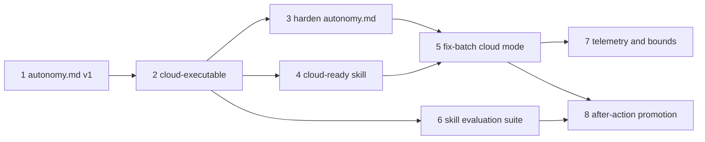

# Roadmap

**Status:** living document | **Last updated:** 2026-08-07

The builder-facing execution plan: which skills get built and in what order. For the reader-facing narrative of what the kit offers, see [`docs/CATALOG.md`](docs/CATALOG.md). For atomic work in flight, see [`.tasks/`](.tasks/); for finished work, [`CHANGELOG.md`](CHANGELOG.md). Altitude model in the work-altitude-model section of [`AGENTS.md`](AGENTS.md).

Seeded 2026-07-23 from `docs/CATALOG.md`. Features here stay at the 10,000-foot layer until it is their turn; only then are they decomposed into `.tasks/` files.

---

## Current state

The kit exists and dogfoods itself. Shipped and verified:

- **`init-worktracking`** (hardened): tiered footprint, idempotent re-runs, seed-by-inspection, shipped `validate.py`, migration dry-run, decoupled house-style module.
- **`new-task`**: gold-standard task authoring, the upstream that feeds `fix-batch`.
- **`project-bootstrap`** (blessed 2026-07-24): the umbrella front door; stack-aware baseline (gitignore, editorconfig, linter/formatter from a swappable house code-style layer, license, README stub) that then calls `init-worktracking`.
- **`pr-describe`** (blessed 2026-07-24): the closing bookend; drafts a PR body and a changelog entry from a branch's diff (or the working tree), in the target repo's own format, without touching GitHub.
- **Tooling**: `scripts/install.py` (cross-platform installer), `build-adapters.py` (Cursor/VS Code adapters), `validate-skills.py` (kit-level lint).
- **This tracking system**: `AGENTS.md`, `.tasks/`, `ROADMAP.md`, `CHANGELOG.md`.
- **Documentation and handoffs**: `doc-author`, `doc-revise`, `agent-handoff`, and `human-handoff` (blessed 2026-07-24 after in-kit dogfooding and user sign-off).

The parallel-execution back half of the spine has been folded in from the author's global skill set (`~/.claude/skills`):

- **`fix-batch`** and **`reconcile-worktrees`** (blessed 2026-07-24): ported into the kit (`feat-0005`, `feat-0006`), adapted to house style, portability-gated, and wired into the `.tasks/` spine. Blessed after a live in-kit run dispatched two parallel worktree agents (`chore-0001`, `chore-0002`) and reconciled them into main.

---

## Forward plan

Ordered by effort-to-value. Each item is one skill (a Feature). Strike through when shipped.

### Epic A: broadly shareable (the public kit)

1. ~~**`project-bootstrap`.** The umbrella front door: language-aware scaffold (gitignore, editorconfig, linter/formatter, license, README stub) that then calls `init-worktracking`.~~ **Shipped** (`feat-0001` draft, `feat-0002` house code-style layer; blessed 2026-07-24).
2. ~~**`pr-describe`.** Draft a PR body and changelog entry from a branch's diff, in the target repo's own changelog format (draft-only, never touches GitHub).~~ **Shipped** (`feat-0003` draft, `feat-0004` working-tree fallback from field iteration; blessed 2026-07-24).
3. ~~**`house-review`.** House-style review with an explicit rubric and severities, composing the swappable [`review-quality`](.agents/rules/review-quality.md) lens (moonray's quality-lens pattern).~~ **Shipped** (`feat-0007`; blessed 2026-07-24 after dogfooding).
4. **`ci-scaffold`** (hold until used twice). Generate CI (lint + test + build + release) matched to the detected stack.
5. **`release-cut`** (hold until used twice). Version bump, changelog roll-up, tag, notes.
6. ~~**Fold in `doc-author` / `doc-revise`** from `zen-solutions-studio`.~~ **Shipped** (`feat-0011`, `feat-0012`; dogfooded on the in-kit architecture guide and documentation consistency pass, then blessed 2026-07-24 after user sign-off).
7. ~~**Fold in `agent-handoff` / `human-handoff`** (already portable by design).~~ **Shipped** (`feat-0009`, `feat-0010`; dogfooded with the fold-in brief and in-kit partner status update, then blessed 2026-07-24 after user sign-off).
8. **Kit-wide skill evaluation** (recurring). Systematically exercise and evaluate every shipped skill rather than trusting the one dogfood that blessed it, then refine from what the pass finds. Each skill was blessed on a single real use, which proves it works once and leaves other branches unexercised. The three named at the outset, `verifier-agent`'s `blocked` verdict, `test-author`'s characterization mode, and `spec-plan-readiness`'s blocking paths, were all exercised on real triggers on 2026-07-27 (`feat-0024`, `feat-0027`, `feat-0028`) and each run is recorded. The recurring question is what to exercise next. Define what "evaluated" means (which behaviors must be observed, and what evidence counts), run the pass, and record per-skill findings as tasks. Decide as part of the work whether the result is a written evaluation protocol, a reusable `skill-eval` skill, or a fixture-based regression suite under `tests/`; do not presuppose the artifact. This is the natural consumer of the spine itself: specify it with `spec-author`, verify each skill with `verifier-agent`. A first read-only pass ran on 2026-07-25 and its findings are filed under [Kit hardening](#kit-hardening-from-the-2026-07-25-review-pass); that pass covered structure, status claims, and cross-references and deliberately did not exercise any skill's behavior. A second pass on 2026-07-27 did exactly that, going at what each procedure does when run, and found two blockers no reading pass had; its findings are filed under [Kit mechanics hardening](#kit-mechanics-hardening-from-the-2026-07-27-review-pass). **Absorbed 2026-08-07 by [Epic E](#epic-e-delegated-execution-cloud-and-unattended-work) item 6**, which answers the artifact question this item deliberately left open: a fixture-based regression suite under `tests/`, rather than a written protocol or a `skill-eval` skill. The reason it can be answered now is that the consumer arrived. An unattended batch has no human reading each run, so "exercise a skill and judge the result" stops being available and the only evaluation that survives delegation is one a command can run. The recurring question of what to exercise next stays live here; the mechanism moves there.

9. ~~**`tracker-links`: GitHub issue linking.**~~ **Shipped** (`feat-0030`, `feat-0031`; blessed 2026-07-28 after a real dogfood: issue #1 opened, task linked, PR #2 merged, issue closed itself. Coverage honestly recorded at two of seven scenarios in [`docs/spec/tracker-links.verification.md`](docs/spec/tracker-links.verification.md).) Let a task file name the upstream GitHub issue it serves, and have `pr-describe` carry that into the pull request description so merging closes it. Specified in [`docs/spec/tracker-links.md`](docs/spec/tracker-links.md) (`status: approved`, 9 scenarios). The value is not the plumbing but the silent-failure surface around it: GitHub ignores a closing keyword in a pull request title and in comments, ignores it entirely unless the pull request targets the default branch, and closes only the first issue when one keyword is followed by a list. Each failure produces a pull request that looks right, merges cleanly, and leaves the tracker wrong. Dogfooded on this repository's own issues.
10. **Azure DevOps work-item linking** (hold until an ADO board has been used on real work). The same idea against Azure Boards, which uses `AB#{ID}` and supports state transitions (`Fixed AB#1234` moves the item to the Resolved category). Deliberately deferred rather than built alongside GitHub: the kit has no ADO project to exercise it against, and shipping an unexercised integration is the cold ship the contribution bar forbids. Two things make it cheaper than it looks when its turn comes. The `external` field holds the platform's own token verbatim, so an `AB#1234` value needs no new field or translation layer. And the hierarchy already matches: Azure's Epic to Feature to User Story to Task is the work-altitude model this repo already uses. Note before building: Microsoft ships a supported [Azure DevOps MCP server](https://github.com/microsoft/azure-devops-mcp), so the right shape may be composing what an adopter already has rather than shelling out to `az boards`. Decide that with evidence, not in advance.

### Epic B: contract-driven delivery (the agent-workflow spine)

1. ~~**`spec-quality`.** A reusable quality gate for scenario-based specifications: keep contracts observable, non-redundant, grounded in repository context, traceable through stable scenario IDs, and free of implementation planning. Report explicit blockers for ambiguity, uncovered goals or surfaces, and unresolved questions.~~ **Shipped** (`feat-0013`; folded in from `repoprompt-workflows` (Balarama Bosch, MIT), house-styled; blessed 2026-07-24 after dogfooding it on the new `docs/spec/spec-author.md` draft, where it caught five findings; user sign-off recorded).
2. ~~**`spec-author`.** Draft a persistent, executable `SPEC.md` from a raw idea before task decomposition: outcomes, anti-goals, architectural constraints, prior decisions, and mechanically testable verification criteria. It composes `spec-quality`; planning and specification work are read-only for implementation surfaces, and an explicit human approval state is required before `new-task` consumes a specification.~~ **Shipped** (`feat-0017`; authored 2026-07-24 by extracting the drafting discipline from the upstream RPCE Spec workflow into a portable skill that composes `spec-quality`; blessed 2026-07-24 after dogfooding it to draft `docs/spec/test-author.md`, where its `spec-quality` self-check caught six findings before returning a `ready` spec; user sign-off recorded).
3. ~~**`spec-plan-readiness`.** Gate implementation on an approved specification plus an ordered, repository-grounded plan. Block tests, code, and delegation until scenarios, tasks, validation, risks, rollback notes, task-to-scenario traceability, and a first safe task are all explicit.~~ **Shipped** (`feat-0014`; folded in from `repoprompt-workflows` (Balarama Bosch, MIT), house-styled and retargeted from RPCE "Deep Plan" to the kit's `.tasks/` model; blessed 2026-07-24 after gating the `spec-author` build (spec plus a two-task decomposition) to `implementable` with a scenario-to-test map; user sign-off recorded).
4. ~~**`test-quality`.** A reusable test-quality lens for choosing the lowest faithful test layer, naming the plausible defect each test protects, testing the real bug population, asserting meaningful observable outcomes, and handling fixtures, mocks, diagnostics, and trust boundaries deliberately.~~ **Shipped** (`feat-0015`; folded in from `repoprompt-workflows` (Balarama Bosch, MIT), house-styled; blessed 2026-07-24 after applying it to the untested `scripts/validate-skills.py`, producing a layer/oracle recommendation and surfacing a testability issue; user sign-off recorded).
5. ~~**`test-author`** (promoted from the former Epic B). Derive focused acceptance tests from approved specifications and task criteria, while retaining characterization-test support for legacy code with no coverage. Compose `test-quality` and run between implementation and reconciliation so test evidence is part of the core workflow.~~ **Shipped** (`feat-0018`; authored 2026-07-24 by extracting the discipline from the upstream RPCE Test workflow into a portable skill composing `test-quality` and `spec-quality`; blessed 2026-07-24 after dogfooding it to derive the `validate-skills.py` acceptance suite from `docs/spec/validate-skills.md` (11 passing tests, closing `chore-0003`), correctly omitting the accepted S-008 divergence rather than faking a pass; user sign-off recorded).
6. ~~**`spec-conformance`.** Audit every approved scenario and public-surface element against code and test evidence, producing a positive conformance matrix of `Conformed`, `Diverged`, or `Not-built` items and an explicit unreconciled set. It reports, never repairs, implementation divergence.~~ **Shipped** (`feat-0016`; folded in from `repoprompt-workflows` (Balarama Bosch, MIT), house-styled, composing into `fix-batch` verification rather than duplicating it; blessed 2026-07-24 after auditing `scripts/validate-skills.py` against `docs/spec/validate-skills.md` into a conformance matrix with one accepted divergence; user sign-off recorded).
7. ~~**`verifier-agent`.** Independently test an implementation against its approved specification and task acceptance criteria before reconciliation. It composes `spec-conformance`, produces structured pass, fail, or blocked evidence, runs the declared commands, and never edits the implementation it verifies.~~ **Shipped** (`feat-0019`; authored 2026-07-24 against `docs/spec/verifier-agent.md`, the first spec drafted by `spec-author` and explicitly approved before decomposition; blessed 2026-07-24 after dogfooding it on `scripts/validate-skills.py`, where it returned `pass` and caught a live defect neither the tests nor a fresh audit would surface: the conformance matrix's evidence citations had drifted +8 lines after the `chore-0003` refactor, with classifications still correct on stale pointers. It reported the drift rather than repairing it, and the skill was iterated from that evidence; `chore-0005` re-anchored the citations. User sign-off recorded. Completes the core spec-to-reconcile loop; the `blocked` verdict path is specified but not yet exercised on real work).
8. **`user-testing`** (hold, conditional on user-facing work; reasoning restated 2026-08-05). Drive rendered UI workflows against throwaway data, inspect screenshots plus console and network state, and record user-visible defects that automated tests and contract conformance miss. Mark the closeout blocked when real workflow testing cannot run, rather than silently skipping it. **Reviewed against the upstream skill on 2026-08-05 and still held.** Its transferable content is two ideas: run only against a throwaway data location, never real environment data, and mark a closeout blocked rather than silently skipping when workflow testing cannot run. Both are worth having and neither justifies a skill for a kit whose users are mostly not building UI. The calculus that changed is tooling availability, not need. **Trigger to revisit:** the first piece of real user-facing work built with this kit, at which point author it against that work rather than in the abstract.
9. ~~**`doc-sync`.** Detect documentation drift caused by code changes or audit a documentation set, distinguishing current-state docs from human-owned contracts. Default to a code-grounded dry run; require explicit approval before updating current-state documentation and never silently rewrite contract documents. Keep it distinct from `doc-author` and `doc-revise`.~~ **Shipped** (`feat-0020`; authored in-kit 2026-07-25 against `docs/spec/doc-sync.md`, the second spec drafted by `spec-author` and explicitly approved before decomposition, after two open questions on approval auditability and vendored material were resolved into the contract. Dogfooded in dry-run mode across this repository's own documentation set: 38 documents audited, 29 skipped as ledger, 12 findings, nothing modified. It surfaced all three dangling references to a `document` skill that never existed here, plus five drift instances the known-answer set did not anticipate, and correctly declined to edit a contract document. The run's weakness was mechanical precision (13 heuristic hits for 1 true positive) and the skill was iterated from that evidence. Blessed 2026-07-25 after `chore-0006` exercised the apply path; user sign-off recorded. Earlier revisions of this line credited an upstream `document` workflow; no such skill was ever vendored here, and the only surviving trace of its contract is the dry-run-first instruction at `repoprompt-workflows-main/.agents/workflows/Loop.md:194`, so this skill was authored rather than folded in).
10. ~~**`review-depth`.** Select quick, standard, or deep review from deterministic signals: change size, directory spread, severe risk flags, blast radius, and documentation-only scope. Compose it with `house-review` so review effort matches risk and an explicit user choice always overrides detection.~~ **Shipped** (`feat-0035`; authored 2026-07-31, blessed 2026-08-05 on author sign-off. Dogfooded against six in-repository changesets and one external Python repository with a real lockfile, and iterated from what those runs found: the blanket-escalation rule was replaced after four of six changesets tripped it, a prose carve-out was added to `blast_radius` after nineteen referencing files sent a four-line fix to `deep`, and the exclusion classes were proven on a 6512-line `uv.lock` and 938 lines of generated schema. Two dogfood criteria remain unticked and are accepted rather than claimed: the per-changeset depth records were not kept and cannot be reconstructed, so the evidence is recorded as conclusions in the skill body rather than as a per-run table. Using it is also what exposed the mode contradiction inside `house-review`, closed by `chore-0024`).
11. **`maintainability-review`** (hold; reasoning replaced 2026-08-05). An optional, strict structural review lens for unnecessary indirection, file sprawl, spaghetti growth, boundary leaks, and missed simplification. **"Hold until used twice" is no longer the binding reason.** Two better ones replace it. First, upstream does not author this lens either: it syncs it from `cursor/plugins` (the "thermo-nuclear" code-quality review, MIT), so adopting it makes this kit a third-hand vendor, which `NOTICE` already anticipates. Second, and decided by inspection rather than assumed now that `feat-0035` has landed: **`review-depth`'s `deep` tier absorbs most of the need.** It sets three knobs and states it sets nothing else, and one of them is that every category in the `review-quality` lens is considered explicitly and recorded as applied or as one line of "not applicable, and why". Category 5 of that lens is already readability and maintainability (naming, structure, dead code, duplicated logic, needless complexity). So a `deep` review already sweeps this ground and cannot silently skip it. What a dedicated lens would add is strictness beyond one rubric line, not coverage where there was none. **Concrete trigger to revisit:** a real `deep` review whose findings show category 5 is too coarse for the structural problem in front of it. Until that happens the marginal value is small and the vendoring cost is real. If it does happen, author one against the observed gap rather than vendoring a third-hand lens.
12. ~~**Decision log (v1, task-file only).** Have each worktree agent record its non-recoverable decisions (rejected alternatives, deliberately open seams, falsified task premises) in its own task file, and have `pr-describe` surface them. Deliberately excludes the spec-sibling rollup (`docs/spec/<name>.decisions.md`, consumed by `new-task`) until v1 proves the entries are worth reading, and carries an explicit kill criterion so the convention cannot survive by default.~~ **Shipped** ([`feat-0037`](.tasks/done/feat-0037-task-file-decision-log-v1.md); 2026-08-05, in a four-item parallel batch). An optional `## Decisions` section in the task template, defined once there with a four-item exclusion list, referenced in prose by `fix-batch` and `pr-describe` rather than restated, since a link from a skill body into `.tasks/` escapes the installed skill tree. The `fix-batch` item names itself the exception that proves the closeout-bookkeeping rule: `done/`, `CHANGELOG.md`, and `ROADMAP.md` are the same files for every item in a batch, while an agent's own task file is the one file exactly one agent owns. Composes with item 16's mechanical contract in the same file rather than adding a tenth field to it. Kept distinct from item 13's phase 2 (telemetry: retries, budgets, stop signals), which covers mechanical run-state rather than semantic continuity; building them together would conflate the two. Triggered by observed loss rather than by plan: two of three agents in the `feat-0025` batch found their task file's premise factually wrong about the code, and nothing in the system captured it. **Kill criterion, first data point:** the implementing agent wrote three entries into its own task file and all three are unrecoverable from the diff, the verification record, or the spec. Review again after the next batch of three or more agents before deciding whether the rollup is worth building.
13. **Enforcement hooks, then telemetry** (was `telemetry-guard`; reframed 2026-08-05). The original item was scoped as run-state telemetry, and reading the upstream sources showed that was second in line rather than wrong. Every rule this kit enforced was prose, which holds only while the model keeps it in context and fails for rules that must fire when nobody is thinking about them, so the higher-leverage first move was enforcing the spine already built.
    - ~~**Phase 1: the `.agents/hooks/` module.** A portable stdlib-Python guardrail protocol with two shapes, a *reminder* that injects context and never blocks and a *gate* that blocks only when the condition is decidable from the payload rather than interpreted from prose.~~ **Shipped** (`feat-0038` established the module, its contract, three-harness wiring and opt-in installation, seeded with `delegation-reminder`; `feat-0039` added `spec-conformance-gate`, the first gate. Both adapted from `repoprompt-workflows` (Balarama Bosch, MIT). Two findings worth carrying forward: the dogfood caught the hook silently inert on `Agent` delegations and a `python3` registration that on Windows resolves to the Store alias and fails forever without surfacing, both being the same failure shape, installed and correct-looking and doing nothing; and the faithful port of the gate would have been inert here, since this kit's spec lifecycle is `draft` then `approved` and stops, so it gained a second trigger on task closure. A guardrail that cannot fire in the repository that ships it is one nobody has ever seen work).
    - **Phase 2: telemetry and bounds** (not built; **absorbed 2026-08-07 by [Epic E](#epic-e-delegated-execution-cloud-and-unattended-work) item 7**). Structured lifecycle events, retry and implementor/verifier-cycle limits, time or optional compute budgets, repeated-work detection, and a clear stop signal on a bound violation. Phase 1 deliberately shipped none of it, because none is needed to make a reminder fire or a gate block, and the repeated-work half now has its own item below (`feat-0042`) since it depends on a finding signature rather than on run state. The reason it stayed unbuilt is the reason it moves: telemetry has no consumer while a human is watching every run, and Epic E item 5 is what first creates batches nobody is watching. It is held behind that item there rather than sequenced here.
    - **Deferred within phase 1: `test-quality-reminder`.** Upstream's Stop-gate hook, which blocks stopping when a test file was edited without both a suite run and a `test-quality` invocation after it. The edit-run-vet-stop ordering is worth having. Its implementation carries several hundred lines of shell-command parsing to decide whether a `Bash` call was a test run, with wrapper-word stripping and package-manager subcommand exclusion, and that heuristic pile is not worth importing before the module has proven itself. Revisit once a gate has run unattended for a while.
14. **`context-sync`** (hold until used against one real integration). Ground an agent in a narrowly defined live source, such as a schema or API contract, with recorded source, version or timestamp, authority level, failure behavior, and reproducible provenance for verification. Do not ship a generic MCP wrapper without field iteration.
15. ~~**Evidence gate and stable finding signature.** Require every review finding to carry a resolvable citation (path, line range, symbol, and an exact quote of the cited code), and drop any finding whose quote does not resolve against the file on disk. Give each finding a stable signature (severity, normalized path, summary, area id) so findings can be deduplicated across lenses and counted across runs.~~ **Shipped** ([`feat-0040`](.tasks/done/feat-0040-evidence-gate-and-finding-signature.md); 2026-08-05, in a four-item parallel batch). The evidence shape, the gate's five-branch disposition table, and the signature live in the `review-quality` lens; `house-review` applies them as a named step and `verifier-agent` cites code the same way. Two design points were forced by the work rather than planned: a quote found at a shifted line is **re-anchored and reported, not dropped**, since the finding is real and only the pointer moved, and a finding whose evidence is an **absence** (a missing test, an unhandled branch) has its own citable form, or the gate would have silently suppressed the whole test-coverage category. Dogfooded against `b50cc76`, a commit the implementing agent did not write: 3 candidates, 1 dropped for a quote resolving nowhere, 1 re-anchored 49 to 74, 1 absence finding kept. Building it also exposed that the `review-depth` composition was one-directional, since `house-review` had never named it back. Not speculative: `verifier-agent`'s own dogfood found a conformance matrix whose classifications were correct and whose line citations had drifted eight lines after a refactor, caught only because a human looked. `review-quality` rule 2 already asks for validation before reporting; this makes it mechanical. Taken from `repoprompt-workflows`' Deep Review governance without taking the workflow.
16. ~~**Delegate evidence contract for `fix-batch`.** Require a fixed field set from every worktree agent's report (task id, covered scenarios, files changed, tests, the validation command **and** its verbatim result, findings in the evidence shape above, recommended next step), and block acceptance when a field is missing. Reject transcript-style reports.~~ **Shipped** ([`feat-0041`](.tasks/done/feat-0041-delegate-evidence-contract-for-fix-batch.md); 2026-08-05, in a four-item parallel batch). Nine fields, each checkable by the orchestrator in one pass and answerable from inside a single worktree, enforced at both ends: `fix-batch` quotes the list into every dispatched prompt and gates Step 6 on it, and `reconcile-worktrees` refuses to land a worktree whose report does not meet it. The dogfood was unusually direct, since the batch that implemented this task was dispatched by the pre-contract `fix-batch` with a hand-rolled report shape: seven of that draft's nine fields survived verbatim, it had **missed** "tests added, changed, or run" and "blockers and assumptions" (both places where an agent's silence is indistinguishable from a clean result), and its `decisions` field was correctly refused as belonging to item 12's decision log rather than to the mechanical contract. The value is not the ceremony: "the validation command and its result" cannot be answered in prose without either running it or lying. Kept distinct from the decision log in item 12, which carries semantic continuity while this carries mechanical evidence. Taken from `repoprompt-workflows`' Loop workflow, without its ledger and budget machinery, which assumes a persistent orchestrator this kit does not have.
17. **Repeat detection and futility classification.** After N failed fix attempts or M observations sharing a finding signature, force a classification into `false_positive`, `core_issue`, or `futility`, and defer a futile finding as its own task rather than retrying it. Scoped as [`feat-0042`](.tasks/feat-0042-repeat-and-futility-classification.md). It was genuinely blocked on item 15, since without a stable signature there is nothing to count; item 15 shipped on 2026-08-05, so the signature now exists and this is unblocked. **The only preventive item in this group**: unlike 15 and 16, which each fix a failure this repository has already observed, this one fixes a predicted one, so it carries an explicit kill criterion. If no batch trips the trigger in the first several real runs, reconsider rather than keep it by default.
18. ~~**Provenance convention for folded-in material.** Record source URL, license, author, retrieval date, and a SHA256 digest of the retrieved content for anything adapted from an external source, and add an on-demand check that re-fetches and reports drift.~~ **Shipped** ([`feat-0043`](.tasks/done/feat-0043-vendored-sync-provenance-convention.md); 2026-08-06, in a four-item parallel batch). Attribution here decayed into folklore in under two weeks: the `doc-sync` line in this file once credited an upstream `document` workflow that was never vendored, and the gitignored fold-in source it cited is now gone from the tree entirely. The convention lives in the conventions section of `AGENTS.md` and [`check-provenance.py`](scripts/check-provenance.py) reports drift on demand, exiting 0, 1, or 2 for match, drift, and unreachable. Upstream's automatic in-place sync was deliberately **not** copied, since every fold-in here was house-styled and retargeted and an overwrite would destroy the adaptation. **The task expected some sources to be unlocatable and none were**: all seven backfill targets carry a real digest from a live 2026-08-06 fetch, 8 records across 7 files, each recording in its own note that the digest pins upstream as of the retrieval date rather than the exact bytes adapted, since the snapshot they were adapted from is gone. Verification re-fetched all eight independently and confirmed three attributions by content rather than by matching path names.

### Considered and declined (2026-08-05)

Recorded so the question is not reopened every time someone reads [`repoprompt-workflows`](https://github.com/moonray/repoprompt-workflows). Each was examined against this kit and rejected for the stated reason, not overlooked.

| Declined | Why |
|---|---|
| `track-work` (upstream skill) | Drives GitHub issues and a project board through `gh`. This kit's tracking is deliberately local, which is what keeps an agent's reading list short and works with no network and no account. `tracker-links` already covers the one direction that matters. |
| `Backlog` workflow | Triages tracked issues into worktrees. `new-task` plus `fix-batch` plus `reconcile-worktrees` already is this, authored against this kit's `.tasks/` model rather than RepoPrompt CE's. |
| `Spec` / `Test` / `Loop` / `Deep-Review` workflows, as whole artifacts | The discipline in each was already extracted into portable skills (`spec-author`, `test-author`, the spine, `house-review`). Taking the orchestration shells too would import RepoPrompt CE runtime assumptions for no gain. Specific mechanisms from them are taken individually as items 15 to 17. |
| Upstream's installer model | Symlink-only and macOS-only. `install.py`'s copy-on-Windows, symlink-on-POSIX, CONFLICT-detecting, manifest-reversible model is the more considered one and already ships. |

### Epic C: semi-scalable (teams and clients)

1. **`repo-explainer`.** A "start here" guided tour of an unfamiliar codebase.
2. **`sop-drafter`.** Turn a described workflow into a documented SOP.
3. **`security-audit`.** Repeatable dependency and secret scan with a written summary.
4. **`adr`.** Architecture decision records / decision log.

### Epic D: personal (stays OUT of the shared kit)

The Content OS pipeline (`produce`, `clip-machine`, `repurpose`, `video-editing`, `video-cutting`, `episode-brief`, `youtube-transcript`, `idea-discovery`) stays in `zen-solutions-studio` as portfolio demos, not plug-and-play kit skills.

### Epic E: delegated execution (cloud and unattended work)

Added 2026-08-07. The goal is to move the large majority of development into cloud agent sessions rather than a remote desktop, across this repository and several others, so work continues away from the machine. Everything in this epic follows from two properties of such a session, and neither is a limitation to work around: they are what the epic is designed against.

**A cloud session sees only what is committed.** Nothing under `.claude/` is tracked here (`git ls-files .claude` returns nothing; the directory holds only `worktrees/`), and this kit's own skills are installed at user scope by [`install.py`](scripts/install.py). So a cloud session that clones this repository has none of them loaded, and the repository that builds the kit is the one repository where the kit is absent. Anthropic's 2026 agentic coding trends report names this the delegation gap and puts structured intent specifications in the safeguard position, which is the spine Epic B already built.

**A cloud session cannot stop and ask.** Anthropic's own best-practices guidance makes this the deciding factor and answers it in one line, "give Claude a check it can run". Every interactive check this repository has is a person reading output, so the first item below turns the ones that matter into a command.

The gap exists only for the two global-scope harnesses. Claude Code and OpenCode discover skills from a global directory (`~/.claude/skills`, `~/.agents/skills`), while Cursor and VS Code get repository-level adapters from [`build-adapters.py`](scripts/build-adapters.py); neither adapter tree is committed here, which is a separate question held below rather than solved here.

**Design bar:** this maintainer's multi-repo workflow first, generalize after. The portability contract in the portability-contract section of [`AGENTS.md`](AGENTS.md) is a hard gate at ship time for the two items that generalize (4 and 5 below), and deliberately not a design constraint on items 1 and 2, which are allowed to be about this repository. Harnesses in scope: Claude Code, Codex, Cursor, Windsurf.

**Kit-wide autonomy ceiling.** An unattended agent pushes to a `claude/` branch and opens a **draft** pull request carrying its evidence report. It never merges. This is the ceiling for everything in this epic and is not an item's to relax.

1. **`autonomy.md` v1** (item 2a of the original decomposition, and deliberately first). **v1 authored 2026-08-07, not blessed**: it ships as a module and travels with the skills, but the contribution bar holds, so it stays unstruck until item 2's run has exercised it and item 3 has hardened it from what that found. Eight rules, `A1` to `A8`, every one carrying its citation, plus three candidates named and held for want of one. A fourth swappable module at `.agents/rules/autonomy.md`, beside [`house-style.md`](.agents/rules/house-style.md) and [`review-quality.md`](.agents/rules/review-quality.md), organized around one named principle with the rules as its applications: **detect and report, never rewrite; the failure mode must be inaction.** This is a consolidation, not an invention. The principle is already applied in four independent places in this kit and named in none of them: [`doc-sync`](.agents/skills/doc-sync/SKILL.md) states it outright, [`house-review`](.agents/skills/house-review/SKILL.md) is report-only by protocol rule 6, `install.py --check` reports a stale copy and never refreshes it, and [`check-provenance.py`](scripts/check-provenance.py) reports drift rather than syncing, which `feat-0043` chose deliberately against upstream's in-place rewrite. **Every rule in v1 carries a citation** to where it was already exercised: a `file:line`, a task id, or a recorded incident. A rule that cannot be cited does not go into v1 and waits for item 3. That is [`feat-0040`](.tasks/done/feat-0040-evidence-gate-and-finding-signature.md)'s evidence gate applied to a rules module, and it exists because an invented rule reads exactly like a consolidated one and nothing else would catch the difference. The verified candidate pile: the sandbox rule stated explicitly rather than implied by isolation; never modify a file outside declared scope; verification is run by someone other than the agent whose work is verified; the validation command and its verbatim result as two separate fields, with no gap closed by inference from prose; disclose opportunistic work, grounded in two failures observed in `fix-batch` runs, an undisclosed test method that never existed in the repository's history and an undisclosed opportunistic bug fix; a partial audit is never reported as a whole one; never overwrite a file you did not create, report the conflict and stop; open a draft pull request and never merge your own work. [`bug-0018`](.tasks/bug-0018-reinstall-destroys-an-adopter-edited-lens.md) is the same principle failing in practice and is worth citing as such. Ordered before item 2 because running a cloud session with no autonomy module is the highest-risk configuration in this epic.

2. **Make this repository cloud-executable.** One Feature, kept whole rather than split, because its three parts are only worth anything together: a session that can check its work but cannot see the skills is as stuck as one that can see them and cannot check. Three parts.
    - **(a) The acceptance command.** One committed script, standard library Python, wrapping the seven gates in [`checks.yml`](.github/workflows/checks.yml), with CI calling it instead of restating them. One rule, two callers, per the precedent [`chore-0029`](.tasks/done/chore-0029-third-copy-of-the-link-rule-in-ci.md) set, where an inline copy of the link rule drifted and let a correctly quoted `CHANGELOG.md` entry pass `--strict` and fail CI. `AGENTS.md` names the script and states in these words that passing it is **necessary but not sufficient**, because CI runs three operating systems by two Python versions and the script runs one.
    - **(b) The bootstrap hook.** A `SessionStart` reminder, a new member of the [`.agents/hooks/`](.agents/hooks/README.md) module following the reminder shape and the opt-in installation contract [`feat-0038`](.tasks/done/feat-0038-hooks-module-and-delegation-reminder.md) set. Detect and report; it never writes. Registered with a `startup` matcher so it does not fire on resume, clear, compact, or fork. The mechanism is a repository-committed hook rather than an account-level environment setup script, because a setup script's output is filesystem-snapshotted for roughly seven days, so an edited skill could be served stale silently, which is the exact silent-wrong-result class this repository keeps getting bitten by. What it checks is **reachability** across project and user scope, with **no environment detection at all**: there is no shared cloud-detection signal across the three harnesses, so explicit detection would mean three detections for one question, which fails the portability contract.
    - **(c) The proof.** Run [`bug-0018`](.tasks/bug-0018-reinstall-destroys-an-adopter-edited-lens.md) end to end through `claude --cloud` under `autonomy.md` v1. **Chosen on 2026-08-07 over `feat-0042`, which this item was first drafted against, because that task's acceptance cannot see its own work**: it edits three skill-body files, and `validate-skills.py`, `validate.py --strict`, and the test suite all pass whatever the prose says, so a session could produce hollow text and clear every gate. `bug-0018` is P1 data loss in shipped code whose acceptance requires a regression test that **fails against the unfixed `install.py`**, which is an outcome a session cannot fake. A proof run whose check cannot distinguish real work from plausible work does not prove the thing this Feature exists to establish. `feat-0042` stays in the backlog, unchanged.
    - **Acceptance:** `bug-0018` lands via a cloud session that opened a draft pull request whose report meets the nine-field evidence contract from [`feat-0041`](.tasks/done/feat-0041-delegate-evidence-contract-for-fix-batch.md), with the acceptance script's verbatim output in it and the regression test shown failing before the change and passing after.
    - **A fourth part was planned and is already done.** The presence half of the bootstrap comes from `install.py --check` failing loudly rather than from a second probe that would duplicate knowledge of where skills live. Checked on 2026-08-07: it already does. `check()` at `install.py:749` exits 2 naming the state as unrecorded when nothing is recorded beneath the given home, shipped by [`chore-0031`](.tasks/done/chore-0031-installed-skills-go-stale-with-no-signal.md) alongside the flag itself and pinned by a test at `tests/test_install.py:1079`. Recorded here rather than left in a report, because a non-defect nobody wrote down is one the next audit re-derives.

3. **Harden `autonomy.md` from what item 2's run revealed, then bless it.** A required task with real acceptance, not an intention. v1 ships deliberately thin, holding only rules this kit has already exercised, so the rules a real unattended run needs and nobody anticipated are found by running one. The contribution bar in the contribution-bar section of `AGENTS.md` forbids blessing it before that.

4. **`cloud-ready` skill.** Generalize item 2's output to any repository, and audit a candidate against the readiness checklist using the severities in [`review-quality.md`](.agents/rules/review-quality.md). **Dogfood trigger already scheduled**, which is why this is a skill and not a note: the maintainer's other repositories have mixed secrets and interactive-authentication status and need auditing before any of them is delegated to. The skill must say plainly that a repository requiring single sign-on is a Remote Control repository, not a cloud-session one, because the failure otherwise is a session that starts, works, and cannot authenticate at the one step that mattered.

5. **`fix-batch` cloud mode.** One `claude --cloud` session per task file, replacing the worktree as the isolation boundary. The `feat-0041` contract is the acceptance gate unchanged, since it was written to be answerable from inside a single isolated workspace and a cloud session is one. **Reconciliation is the real delta and needs its own design rather than an assumption**: [`reconcile-worktrees`](.agents/skills/reconcile-worktrees/SKILL.md) lands verified work from a local directory, and a draft pull request per task is a different shape with different failure modes. Dogfood trigger: the next batch of three or more independent task files.

6. **Fixture-based skill evaluation suite under `tests/`.** Absorbs Epic A item 8, and belongs in this epic rather than that one because delegation is what makes it necessary: an unattended batch has no human reading each run, so the only evaluation that survives is one a command can run. State up front what it will and will not cover, because the honest bound is the useful part. Mechanical skills will cover well (the shape of a generated adapter, a validator's exit code, a task file's structure). Judgment-heavy lenses will cover poorly (`house-review`, `spec-quality`, `review-depth`), because a fixture can pin what a lens outputs and not whether the judgment was right, and a suite that pretends otherwise is worse than no suite. **Acceptance bar: the first run must catch a real regression.** A suite that passes on day one has proven only that it was written against today's behaviour.

7. **Run telemetry and bounds.** Absorbs Epic B item 13 phase 2: structured lifecycle events, retry and implementor/verifier-cycle limits, time or optional compute budgets, and a clear stop signal on a bound violation. Held behind item 5 for the reason it was never built in the first place, telemetry has no consumer while a human is watching every run, and item 5 is what first produces runs nobody is watching.

8. **After-action promotion loop.** A step in the task closeout lifecycle in the work-altitude-model section of `AGENTS.md`, after `doc-sync`: did this run teach the kit anything reusable, and if so file it against the relevant `SKILL.md` or rules module. This is the compounding mechanism, and it is placed in the lifecycle rather than left to intention for the same reason the `doc-sync` step was, which is that its absence has already cost real work. Held behind items 5 and 6, because a promotion loop with no unattended runs to learn from, and no suite to catch what it breaks, is ceremony.

**Ordering.** The numbering above is reading order, not a strict sequence. These are the blocking edges.

Compounding mechanisms in scope are the three above: the evaluation suite (6), run telemetry (7), and the after-action promotion loop (8). Model-capability seams, meaning routing an item to a model tier by the shape of the work, were considered and **declined as speculative**: there is no evidence here about which tier fails on what, and a seam built before that evidence encodes a guess as a contract.

#### Held, with triggers (Epic E)

| Held | Trigger to revisit |
|---|---|
| **Routines** (scheduled unattended runs) | Item 2 lands. Nothing is scheduled until one manual cloud session has completed successfully, because a schedule multiplies whatever the first run gets wrong. |
| **`routine-author` skill** | The second routine is wanted. One routine is a file; two is a pattern. |
| **Committed repository-scope adapters for Cursor and VS Code** | An actual Cursor or Copilot cloud session on one of these repositories. The trees are generated by `build-adapters.py` and committing them is cheap, but committing generated artifacts nobody reads is how a tree goes stale unnoticed. |
| **Self-hosted environments** | A repository that cannot use Anthropic-hosted sessions, or a client engagement requiring it. |
| **Slack and Claude Tag** | More than one person in a repository. Both are for handing work to an agent from where a team already talks, and there is no team here yet. |

#### Considered and declined (Epic E, 2026-08-07)

| Declined | Why |
|---|---|
| Devin-class agents | Unlike Codex and Cursor, it does not read `AGENTS.md`, so supporting it is a genuine new adapter rather than a free one, and it is not in the harness set this epic serves. **Revisit if** an adopter or client uses it. |
| Agent teams and emergent multi-agent coordination | It contradicts a position this kit already holds. Anthropic's own multi-agent research finds coding has fewer parallelizable subtasks than research and that models coordinate poorly in real time, which is why structural fan-out through `fix-batch`, one isolated agent per pre-scoped task file, is the supported shape here. **Revisit if** a real batch fails in a way coordination would have fixed. |

---

## Kit hardening (from the 2026-07-25 review pass)

A read of all 19 shipped skills on 2026-07-25, the first deliberate pass rather than a per-skill dogfood. It found four systemic issues and two gaps that need a decision before they can be decomposed. Filed rather than fixed, so each item can be dispatched to an isolated agent.

Ready to dispatch. Wave 1 is parallel-safe (disjoint `touched_files`); wave 2 waits on `bug-0002`, which touches the same files.

| Task | Wave | What |
|---|---|---|
| [`bug-0002`](.tasks/done/bug-0002-agents-section-references-by-name.md) | 1 | **Portability defect.** Skills reference `AGENTS.md` by section *number*, but the numbering differs between this repo and the repos `init-worktracking` scaffolds. `new-task` is correct for scaffolded repos and wrong here; `spec-plan-readiness` is correct here and wrong there. `.tasks/_TEMPLATE.md` propagates the wrong pointer into every task file. Reference sections by name. |
| [`chore-0007`](.tasks/done/chore-0007-clear-stale-skill-status-claims.md) | 1 | Seven stale status claims, including three skills (`house-review`, `pr-describe`, `project-bootstrap`) that call themselves a draft and shipped in the same file. |
| [`feat-0021`](.tasks/done/feat-0021-iterate-doc-sync-detection.md) | 1 | Iterate `doc-sync` from the four drift instances this review found that its own dogfood missed. Line-scoped matching and an incomplete staleness vocabulary were the causes. |
| [`chore-0008`](.tasks/done/chore-0008-cross-link-doc-trio.md) | 1 | `doc-author` and `doc-revise` have no reference to `doc-sync`; the documentation trio only links one way. |
| [`chore-0009`](.tasks/done/chore-0009-agent-handoff-harness-neutral.md) | 1 | `agent-handoff`'s description hardcodes "Claude Code", putting harness lock-in in the kit's most visible field. |
| [`feat-0023`](.tasks/done/feat-0023-extend-validate-skills-lint.md) | 1 | `validate-skills.py` catches none of the above. Extend it so this class of defect fails a command instead of waiting for a human read. |
| [`feat-0022`](.tasks/done/feat-0022-wire-verifier-agent-into-fix-batch.md) | 2 | Wire `verifier-agent` into `fix-batch` Step 6 and `reconcile-worktrees`. Deferred by `feat-0019` until the skill had been used; it has been. |
| [`chore-0010`](.tasks/done/chore-0010-spec-plan-readiness-compose-test-quality.md) | 2 | `spec-plan-readiness` restates `test-quality`'s layer taxonomy inline instead of composing it. Two copies free to drift. |

Decided on 2026-07-25 and now filed:

| Task | Decision |
|---|---|
| ~~[`chore-0011`](.tasks/done/chore-0011-document-skill-shapes-and-house-style-pointers.md)~~ | **Done.** All 19 skills now reference the house-style module and `AGENTS.md` documents both body shapes. The task's own premise was wrong: four skills needed target-repo-aware wording, not two, and `pr-describe` would have been given a paragraph contradicting a rule in its own body. |
| ~~[`feat-0024`](.tasks/done/feat-0024-exercise-verifier-blocked-branch.md)~~ | **Done.** The `blocked` branch fired on a real unapproved contract and matched S-005 on every clause. Produced `docs/spec/house-review.md` (11 scenarios) and the reusable evaluation-record format at `docs/spec/house-review.verification.md`. Two findings filed as `chore-0014`. |

## Kit mechanics hardening (from the 2026-07-27 review pass)

The second kit-wide pass, and the first to go at what each skill's procedure actually *does* when
run on a real repository rather than at its structure. It found two blockers, five majors, and
eight smaller issues, none visible to either validator. All thirteen were fixed the same day; see
the 2026-07-27 `CHANGELOG.md` entry for the full account. The headline two:

- **The installer shipped the skills without the lenses they compose.** 14 of 19 skills referenced
  `.agents/rules/`, which `install.py` never carried, so `house-review` arrived with no rubric at
  all. Fixed by installing the rules module as the sibling the existing links already assumed.
- **`reconcile-worktrees` silently dropped every new file an agent created.** Its `git diff | git
  apply` mechanism could not see untracked files, and `fix-batch` requires agents to leave work
  uncommitted, so the deliverable landed nowhere and the worktree holding the only copy was then
  deleted.

The pattern behind most of them: the kit is documentation and stdlib Python with no dependency
tree, no large diffs, and no binary assets, so procedures that assume a normal software repository
had never met one. That is the standing risk in dogfooding a tool on the repository that builds it,
and it is what `feat-0025` exists to close.

| Task | What |
|---|---|
| ~~[`feat-0025`](.tasks/done/feat-0025-exercise-batch-loop-on-dependency-bearing-repo.md)~~ | **Done.** Ran a real three-agent batch against `gaudiya-vaishnava-knowledge-wiki` (9 tests to 47). The reconciliation fix was load-bearing: all three deliverables were new files, so all three `git diff` patches were 0 bytes and the pre-fix mechanism would have lost the entire batch while reporting success. Six findings folded back into `fix-batch`, `reconcile-worktrees`, and `new-task`. The batch-loop hardening is no longer cold. |
| ~~[`chore-0012`](.tasks/done/chore-0012-decide-code-review-skill-name.md)~~ | **Done.** Renamed `code-review` to `house-review`, named for the rubric it applies rather than the act of reviewing. Both Open Questions in its contract resolved and re-approved. The rename exposed and fixed a defect in `.tasks/validate.py --strict`, which was checking completed tasks' `touched_files` and so broke permanently on any rename. |
| ~~[`chore-0013`](.tasks/done/chore-0013-amend-validate-skills-contract.md)~~ | **Done.** Amended the `validate-skills` contract to cover the four checks the implementation had outgrown it by, and the regenerated matrix caught a live divergence in `S-014` while doing it: the check had shipped on 2026-07-25, was believed correct for two days, and only surfaced once a scenario stated the condition semantically instead of restating the implementation. Fixed the same day. |
| ~~[`feat-0026`](.tasks/done/feat-0026-write-build-adapters-spec.md)~~ | **Done.** Wrote and approved `docs/spec/build-adapters.md` (13 scenarios), closed the five that had no test (30 to 35 tests), and restored the softened documentation claims. The audit surfaced one unstated contract decision: an existing rules file is preserved but an edited skill template is overwritten, an asymmetry invisible to both the spec and the tests. Recommendation recorded; the call is human. |

**All three branches are now exercised on real work**, each on a genuine trigger rather than a staged
one, and each recorded in the format `feat-0024` established:

- ~~**`verifier-agent`'s `blocked` verdict**~~ (`feat-0024`), at [`house-review.verification.md`](docs/spec/house-review.verification.md).
- ~~**`test-author`'s characterization mode**~~ (`feat-0027`), at [`install.characterization.md`](docs/spec/install.characterization.md).
- ~~**`spec-plan-readiness`'s blocking paths**~~ (`feat-0028`), at [`build-adapters.readiness.md`](docs/spec/build-adapters.readiness.md).

Each run found something the branch itself was not being tested for: an unresolved precondition
ambiguity (`chore-0014`), two testability defects in `install.py`, and a second seam between the
spine's front and back halves (`chore-0016`, now closed). Exercising a branch on real work has so far
been more productive than the branch coverage was the point of.

Both seams between the spine's halves are now closed. `spec-plan-readiness` was folded in from
upstream against a different planning artifact, and its Step 3 requirements had never been reconciled
against the task format this kit authors: `feat-0025` added task-to-scenario traceability and
`chore-0016` added risk and rollback notes. A full re-read of that list during `chore-0016` found no
third gap, so the two were the whole of it.
- **The wider spec and test coverage question.** Even after `feat-0024`, 5 of 19 skills will have a contract and none will have behavioral tests. Whether that gap is worth closing skill by skill, or whether the targeted-branch approach is sufficient, is a judgment to make once there is evidence from the first three exercises.

---

## Out of scope by design

- No database or service dependency anywhere in the kit. Everything is markdown, `SKILL.md`, and stdlib Python. Portability is the whole point.
- No skill ships to the kit cold. A skill is drafted, used on real work, iterated, then blessed. Speculative skills stay at this roadmap altitude, not in `.agents/skills/`.
