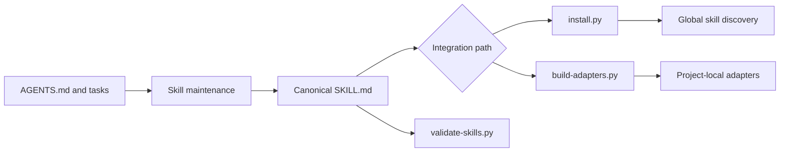
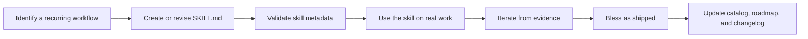

# Architecture

This guide explains how Zen Agent Skills is organized and maintained for contributors and technical adopters.

## Purpose

The kit keeps reusable agent procedures portable across coding harnesses. A skill has one canonical instruction body, then the repository either installs that source into a tool's global discovery location or generates a thin, tool-native project adapter.

The kit deliberately has no runtime application, database, service, or third-party Python dependency. Its deliverables are Markdown skills and standard-library Python tooling.

## System overview



## Core components

### Canonical skill source

Each directory in [`.agents/skills/`](../.agents/skills/) contains a `SKILL.md` with YAML frontmatter and a harness-agnostic procedure. That file is the only hand-maintained source for the skill's behavior. Supporting templates, references, and scripts may sit alongside it when the skill needs them.

[`scripts/validate-skills.py`](../scripts/validate-skills.py) checks every skill's frontmatter, directory-name match, description quality signal, and body length. It also fails on unresolved relative links, on references to sibling skills that do not exist, on links that escape the shipped skill tree (which resolve in this repository but dangle once a skill is installed), and on a description longer than the 1024 characters both target harnesses allow, and warns when a skill claims both draft and shipped status, so cross-reference drift is caught by a command rather than by a human reading. It is the minimum validation gate after changing a skill.

The description ceiling is an error rather than a warning because the limit is external and absolute: a description over it is rejected or truncated by the harness, so the skill is never selected, and the symptom is silence rather than a failure. Five skills shipped over that limit before the check existed. The field is also measured as a YAML parser would measure it, so a description written as a block scalar is not charged for the indicator that introduces it.

It also enforces the rest of the skill schema, which is external and not the kit's to choose: no angle bracket in a description, and no frontmatter property outside the six the schema permits (`name`, `description`, `license`, `allowed-tools`, `metadata`, `compatibility`). And it fails on frontmatter written in a form a real YAML parser rejects, which is narrower than it sounds: the standard-library-only rule means there is no YAML library to call, so it targets the one construct that has actually shipped, a plain unquoted value containing a colon followed by a space.

**Those checks exist because of the sharpest lesson this repository has learned, and it is a lesson about method.** Three separate defects shipped in the `description` field over two days: five descriptions over the harness limit, eight unreadable by any YAML parser, and one containing angle brackets the schema forbids. Each passed all four gates, an approved contract, and a clean conformance matrix, because the kit's own regex parser and its own spec agreed with each other and both disagreed with the schema. None was found from inside. They were found by running external implementations over the real tree: a third-party installer, and Anthropic's reference validator. Where a tool reimplements an external standard rather than calling it, conforming to the spec is not evidence of conforming to the standard, and the closing move is to run the reference implementation. All nineteen skills passed both when that was measured on 2026-07-29. The twentieth, `review-depth`, was added on 2026-07-31 and has been through this repository's own validator but not yet through Anthropic's, which is tracked as `chore-0028`; the whole point of this paragraph is that those are not the same check.

### Distribution tooling

[`scripts/install.py`](../scripts/install.py) places the canonical skill directories into the global discovery locations used by Claude Code and OpenCode. It is idempotent, defaults to copies on Windows and symlinks on POSIX systems, and avoids overwriting unmanaged targets. It also places [`.agents/rules/`](../.agents/rules/) as the sibling of the installed skills directory, which is where every skill's `../../rules/<file>.md` reference resolves to. Without it a composed lens dangles, and `house-review` in particular arrives with no rubric, since its severities and categories live entirely in the lens.

A `--profile` selects how many skills to place (`core`, `spine`, or `all`), and the run reports the total description characters for each, since every installed description is loaded so an agent can route to it. The profile is expanded over sibling references before anything is placed, so a subset can never ship a skill whose composed sibling is absent. That constraint, rather than editorial judgment, is what fixes the profile sizes: the reference graph has one strongly connected component of fifteen skills, so a profile touching any of them is at least eighteen, and only `agent-handoff` with `human-handoff`, plus the three skills that reference no sibling, are separable. The default is `spine`, which is smaller than `all` and drops the handoff pair.

[`scripts/build-adapters.py`](../scripts/build-adapters.py) handles tools that use project-level configuration. It reads each canonical `SKILL.md` and generates:

- `.cursor/rules/<skill-name>.mdc` for Cursor.
- `.github/prompts/<skill-name>.prompt.md` for VS Code or Copilot.
- `.agents/rules/` and `.agents/skills/<skill-name>/`, the shared material both adapter sets link to.

An adapter does not sit where the skill sits, so inlining a body verbatim would break every relative link in it. Three classes are rewritten as the body is inlined: a sibling skill becomes the adapter generated beside it, the rules module becomes `../../.agents/rules/<file>`, and a skill-local template becomes `../../.agents/skills/<name>/<path>`. Both adapter directories are two levels below the project root, so the shared material has one location rather than one per target. An existing `.agents/rules/` file is never overwritten, since that module is swappable and a project's own copy outranks the kit's.

These adapters are derived artifacts. Change the source skill, then regenerate them. Do not maintain a second, hand-edited copy of the instructions.

### Behavioral specifications and tests

Since the contract-driven delivery spine shipped, the kit maintains two further classes of first-class artifact.

[`docs/spec/`](spec/) holds behavioral specifications: the contracts that skills and tooling are built and audited against. A specification is written by `spec-author`, checked by the `spec-quality` lens, and carries a `status` of `draft` or `approved`, because human approval is an explicit state rather than an implied one. Scenarios use stable `S-NNN` identifiers, which is what makes the chain traceable: `spec-plan-readiness` maps those identifiers to test layers, `test-author` tags each derived test with the identifier it covers, and `spec-conformance` later audits the same identifiers. Reports sit beside their specification, one file kind per question asked: `<spec>.conformance.md` audits code against the contract, `<spec>.verification.md` records a verdict with evidence, `<spec>.readiness.md` records a go/no-go gate over a spec plus its task decomposition, and `<spec>.characterization.md` records behavior pinned before a contract existed.

[`tests/`](../tests/) holds the kit's own test suite, derived from those specifications rather than written ad hoc. Tests are evidence for the verification step, not a substitute for it: a green suite asserts code contracts, while conformance asserts that behavior matches the specification.

`verifier-agent` closes the loop by combining the two before anything lands: it runs the declared commands, composes `spec-conformance` so a contract divergence withholds a passing verdict even when every test passes, and returns `pass`, `fail`, or `blocked`. The `blocked` verdict exists so a verification that could not run is never recorded as one that passed.

Documentation is treated as a fourth class of artifact rather than an afterthought. `doc-sync` detects drift by checking prose claims against repository facts, classifying every document as current-state (correctable with explicit approval), contract (report-only, because a disagreement there means the code is wrong), or ledger (skipped, because history is not drift). Detection is a dry run by default and never edits a file on its own.

### Governance and work tracking

[`AGENTS.md`](../AGENTS.md) is the canonical instruction file for agents working in this repository. It defines the reading protocol, portability contract, and contribution bar.

The kit dogfoods its own work-tracking model:

- [`ROADMAP.md`](../ROADMAP.md) records the ordered, builder-facing plan.
- [`.tasks/`](../.tasks/) contains atomic, agent-assignable work items.
- [`CHANGELOG.md`](../CHANGELOG.md) is the append-only record of completed work.
- [`docs/CATALOG.md`](CATALOG.md) is the reader-facing catalog of available skills and their shipping status.
- [`docs/spec/`](spec/) holds the behavioral contracts, and [`tests/`](../tests/) the tests derived from them.

Work tracking stays local by design, because that is what keeps an agent's reading list short and the system usable offline. A task may nevertheless name the GitHub issue it serves through an optional `external` field, which `pr-describe` carries into the pull request description as a closing reference. The link is one-directional on purpose: the task file is the source of truth and nothing is ever read back from GitHub, so there is no second writable copy to diverge from. The contract is [`docs/spec/tracker-links.md`](spec/tracker-links.md); the practical guide is [`ISSUE-LINKING.md`](ISSUE-LINKING.md).

## Authoring and release flow



The final dogfooding step is intentional. A skill is not considered shipped merely because its prose is complete. It must be exercised on real work, refined if the use exposes a gap, and then explicitly blessed.

## Extension boundaries

- Keep procedural logic in `SKILL.md`, not in generated adapters.
- Keep generated adapters thin and regenerate them after a skill change.
- Use [`.agents/rules/house-style.md`](../.agents/rules/house-style.md) for swappable writing conventions rather than hardcoding a voice into every skill.
- Add a portability gate only when a skill needs harness-specific behavior. The default body should remain useful without a single vendor tool.
- Keep planned skills in [the roadmap](../ROADMAP.md) until there is a real use case. Do not add speculative skills to the public catalog.

## Verification

Run these commands from the repository root after changing a skill or distribution path:

```bash
python scripts/validate-skills.py
python -m unittest discover -s tests -p "test_*.py"
python scripts/build-adapters.py --dry-run
python scripts/install.py --dry-run --home ./.tmp/zen-home
python .tasks/validate.py --strict
```

The test suite is not optional here. [`tests/`](../tests/) covers the distribution tooling itself, so a change to `install.py` or `build-adapters.py` is exactly the case the suite exists to catch.

The [README](../README.md) provides the adopter-facing overview and quick start; [`INSTALL.md`](INSTALL.md) holds the complete integration and troubleshooting reference.
