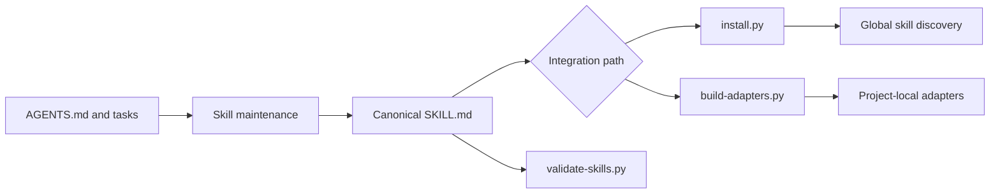
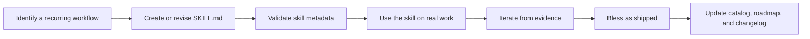

# Architecture

This guide explains how the Zen Starter Kit is organized and maintained for contributors and technical adopters.

## Purpose

The kit keeps reusable agent procedures portable across coding harnesses. A skill has one canonical instruction body, then the repository either installs that source into a tool's global discovery location or generates a thin, tool-native project adapter.

The kit deliberately has no runtime application, database, service, or third-party Python dependency. Its deliverables are Markdown skills and standard-library Python tooling.

## System overview



## Core components

### Canonical skill source

Each directory in [`.agents/skills/`](../.agents/skills/) contains a `SKILL.md` with YAML frontmatter and a harness-agnostic procedure. That file is the only hand-maintained source for the skill's behavior. Supporting templates, references, and scripts may sit alongside it when the skill needs them.

[`scripts/validate-skills.py`](../scripts/validate-skills.py) checks every skill's frontmatter, directory-name match, description quality signal, and body length. It is the minimum validation gate after changing a skill.

### Distribution tooling

[`scripts/install.py`](../scripts/install.py) places the canonical skill directories into the global discovery locations used by Claude Code and OpenCode. It is idempotent, defaults to copies on Windows and symlinks on POSIX systems, and avoids overwriting unmanaged targets.

[`scripts/build-adapters.py`](../scripts/build-adapters.py) handles tools that use project-level configuration. It reads each canonical `SKILL.md` and generates:

- `.cursor/rules/<skill-name>.mdc` for Cursor.
- `.github/prompts/<skill-name>.prompt.md` for VS Code or Copilot.

These adapters are derived artifacts. Change the source skill, then regenerate them. Do not maintain a second, hand-edited copy of the instructions.

### Behavioral specifications and tests

Since the contract-driven delivery spine shipped, the kit maintains two further classes of first-class artifact.

[`docs/spec/`](spec/) holds behavioral specifications: the contracts that skills and tooling are built and audited against. A specification is written by `spec-author`, checked by the `spec-quality` lens, and carries a `status` of `draft` or `approved`, because human approval is an explicit state rather than an implied one. Scenarios use stable `S-NNN` identifiers, which is what makes the chain traceable: `spec-plan-readiness` maps those identifiers to test layers, `test-author` tags each derived test with the identifier it covers, and `spec-conformance` later audits the same identifiers. A conformance report sits beside its specification as `<spec>.conformance.md`.

[`tests/`](../tests/) holds the kit's own test suite, derived from those specifications rather than written ad hoc. Tests are evidence for the verification step, not a substitute for it: a green suite asserts code contracts, while conformance asserts that behavior matches the specification.

### Governance and work tracking

[`AGENTS.md`](../AGENTS.md) is the canonical instruction file for agents working in this repository. It defines the reading protocol, portability contract, and contribution bar.

The kit dogfoods its own work-tracking model:

- [`ROADMAP.md`](../ROADMAP.md) records the ordered, builder-facing plan.
- [`.tasks/`](../.tasks/) contains atomic, agent-assignable work items.
- [`CHANGELOG.md`](../CHANGELOG.md) is the append-only record of completed work.
- [`docs/CATALOG.md`](CATALOG.md) is the reader-facing catalog of available skills and their shipping status.
- [`docs/spec/`](spec/) holds the behavioral contracts, and [`tests/`](../tests/) the tests derived from them.

## Authoring and release flow



The final dogfooding step is intentional. A skill is not considered shipped merely because its prose is complete. It must be exercised on real work, refined if the use exposes a gap, and then explicitly blessed.

## Extension boundaries

- Keep procedural logic in `SKILL.md`, not in generated adapters.
- Keep generated adapters thin and regenerate them after a skill change.
- Use [`.agents/rules/house-style.md`](../.agents/rules/house-style.md) for swappable writing conventions rather than hardcoding a voice into every skill.
- Add a portability gate only when a skill needs harness-specific behavior. The default body should remain useful without a single vendor tool.
- Keep planned skills in [the roadmap](../ROADMAP.md) until there is a real use case. Do not add speculative skills to the public catalog.

## Verification

Run these commands from the repository root after changing a skill or distribution path:

```bash
python scripts/validate-skills.py
python scripts/build-adapters.py --dry-run
python scripts/install.py --dry-run --home ./.tmp/zen-home
python .tasks/validate.py --strict
```

The [README](../README.md) provides the adopter-facing quick start and integration commands.
