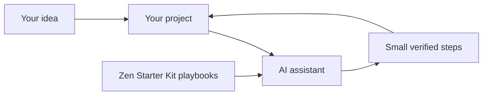
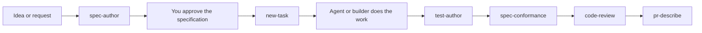

# Zen Starter Kit: a founder's getting-started guide

This guide is for founders, builders, creators, and curious newcomers who want a calmer way to use AI coding tools on a new or existing project.

You do not need to be a professional developer to begin. You need a project idea, a place to keep the project, and an AI coding tool you are willing to learn one small step at a time.

## 🌱 Start here

The Zen Starter Kit is a collection of reusable playbooks for working with an AI coding assistant.

Think of it like a well-organized studio shelf:

- 🧭 **The kit** is the shelf of playbooks.
- 🛠️ **A skill** is one playbook for a recurring job, such as setting up a project, turning an idea into a task, reviewing a change, or preparing a handoff.
- 🤖 **Your AI coding tool** is the assistant that follows the playbook. Examples include Claude Code, Cursor, VS Code with Copilot, and OpenCode.
- 📁 **Your project** is the thing you are building: a website, app, automation, internal tool, research project, or other digital product.

The kit does not build a product for you by itself. It gives you a repeatable way to ask your AI assistant for help, keep decisions organized, and move from idea to verified progress.

## ✨ What this repository does

The repository contains:

- 🧰 Reusable agent skills in [`.agents/skills/`](../.agents/skills/).
- 📦 An installer for Claude Code and OpenCode in [`scripts/install.py`](../scripts/install.py).
- 🔌 Project adapters for Cursor and VS Code or Copilot in [`scripts/build-adapters.py`](../scripts/build-adapters.py).
- ✅ A skill checker in [`scripts/validate-skills.py`](../scripts/validate-skills.py).
- 🗺️ A work-tracking system with tasks, a roadmap, and a changelog.
- 📚 Documentation for both people and agents, including the [architecture guide](ARCHITECTURE.md) and [skill catalog](CATALOG.md).

The kit is intentionally lightweight. It is Markdown plus standard-library Python scripts. It does not require a database, hosted service, or special Zen platform account.

## 🧠 The simple mental model

There are three layers to understand:

1. **Your project:** the folder or repository containing the product you want to build.
2. **Your AI assistant:** the tool you use to talk through ideas and make changes in that project.
3. **The starter kit:** a set of instructions that helps the assistant work in a consistent, checkable way.

The starter kit does not replace your AI assistant. It gives the assistant better repeatable habits.



## 🧭 Choose your starting path

Choose the description that sounds most like you today:

- 🌟 **I have a new idea or an empty project folder.** Follow [the new-project journey](#-the-new-project-journey).
- 🏗️ **I already have a project, but it feels scattered or hard to hand off.** Follow [the existing-project journey](#the-existing-project-journey).
- 🧹 **I already have a project process and only want better AI instructions.** Start with [the light-touch path](#-the-light-touch-path).
- 👥 **I am building with a team or several AI agents.** Read [the collaboration journey](#-the-collaboration-journey).

You can start small. You do not need to adopt every skill on day one.

## 💻 Before you begin

You will need:

- 🐍 **Python 3.9 or newer.** The kit's small setup tools use Python.
- 🌿 **Git.** Git is the version history for your project. It lets you see what changed and return to an earlier point when needed.
- 🤖 **An AI coding tool.** Use the tool you already have or want to try.
- 📂 **A project folder or repository.** This can be empty for a new project or already full of work.
- 🧪 **A willingness to review changes.** AI is a collaborator, not an autopilot. You remain the person who approves important decisions and changes.

Check Python from a terminal:

```bash
python --version
```

If your computer uses `python3` instead of `python`, use `python3` in the commands in this guide.

## 🚀 The new-project journey

This path is for a new idea, a nearly empty repository, or a project that has not yet developed a reliable structure.

### 1. Give the project a home

Create a repository on GitHub or another Git host, then clone it to your computer. A repository is simply a project folder with version history attached.

```bash
git clone <your-project-url>
cd <your-project-folder>
```

If you are not ready to use a remote host, create a local folder and initialize Git in it:

```bash
mkdir my-project
cd my-project
git init
```

You can replace `my-project` with the name of your project.

### 2. Get the starter kit

Keep the kit in its own folder. It can then be reused across multiple projects.

```bash
git clone https://github.com/hams-ollo/zen-starter-kit.git
cd zen-starter-kit
```

The kit is not copied into every project. Its skills are installed into your AI tool or translated into project-level files, depending on the tool you use.

### 3. Preview the installation

A preview shows what the installer would do without changing anything:

```bash
python scripts/install.py --dry-run
```

This is a useful habit whenever you are unsure what a setup command will touch.

### 4. Install the skills for your AI tool

For Claude Code and OpenCode, install the default skill set:

```bash
python scripts/install.py
```

Install only one of those tools when needed:

```bash
python scripts/install.py --tools claude
python scripts/install.py --tools opencode
```

For Cursor or VS Code with Copilot, generate project-level adapters from the kit directory:

```bash
python scripts/build-adapters.py --target cursor,vscode --out <path-to-your-project>
```

The adapter files are instructions for that project. They are generated from the canonical skills in this repository, so you should change the source skill rather than editing the generated file by hand.

### 5. Ask the assistant to set up the project

Open your new project in your AI coding tool and ask it to use the `project-bootstrap` skill.

You can begin with this prompt:

> I am starting a new project in this repository. Use the `project-bootstrap` skill. First inspect what is already here, tell me what you found, and ask me to confirm the project type, license, code-style preferences, and work-tracking tier before writing anything. Do not overwrite existing files.

The assistant will inspect the project and, after confirmation, can create a sensible baseline such as:

- 🧹 A `.gitignore` for files that should not be committed.
- 📝 An `.editorconfig` for consistent editor behavior.
- 🎨 Linter and formatter configuration for supported Python or JavaScript and TypeScript projects.
- ⚖️ A license, usually MIT unless you choose another one.
- 📖 A starter README.
- 🗂️ A work-tracking system through `init-worktracking`.

The skill creates configuration. It does not install your programming language packages for you. After setup, follow the package manager instructions for your chosen stack, such as `uv sync`, `npm install`, `pnpm install`, or another command your assistant confirms for this project.

### 6. Describe the first useful outcome

Do not begin with a giant vague request such as “build my whole startup.” Give the assistant one outcome a person can recognize and test.

Try:

> I want a visitor to create an account, see a welcome screen, and sign out. Help me turn this into the first small milestone. Use the project files and existing task system, and tell me what you need me to decide before changing anything.

The assistant can then use `new-task` to turn the idea into an atomic task with a clear acceptance check.

### 7. Work in small loops

A healthy first-project loop looks like this:

1. 💡 Explain one outcome.
2. 🧩 Ask the assistant to break it into a small task.
3. 🗣️ Review the plan in plain language.
4. ✍️ Let the assistant make the change.
5. 🔍 Ask what changed and how it was checked.
6. 🧪 Try the result yourself.
7. 📌 Record the next decision or task.

Small loops keep you in charge and make it easier to notice when the project is heading in the wrong direction.

## The existing-project journey

This path is for a project that already has code, documents, experiments, or a team history.

The goal is not to make the project look brand new. The goal is to give the work a clearer shared memory without erasing what is already there.

### 1. Start with a safety check

Before asking an assistant to reorganize anything:

- 💾 Make sure your current work is saved.
- 🌿 Check your Git status and create a commit or backup if that matches your normal practice.
- 📋 Write down any files or systems that must remain untouched.
- 🧭 Tell the assistant what you already use for tasks, planning, and releases.

A useful opening prompt is:

> I am bringing the Zen Starter Kit into an existing project. First inspect the repository and explain its current structure, tools, task tracking, and important conventions. Do not write files yet. If another tracker already exists, show me a migration plan instead of creating a parallel system.

### 2. Install the kit without moving the project

Follow the installation instructions above. The kit can live separately from your existing project.

For Claude Code or OpenCode:

```bash
python scripts/install.py --dry-run
python scripts/install.py
```

For Cursor or VS Code with Copilot, generate adapters into the existing project:

```bash
python scripts/build-adapters.py --target cursor,vscode --out <path-to-your-project>
```

### 3. Choose the amount of structure you need

The `init-worktracking` skill offers three footprints:

- 🪶 **Lite:** basic agent instructions and task files. Good for a solo project or a small experiment.
- 🗺️ **Standard:** lite plus a roadmap and changelog. Good for most projects.
- 👥 **Team:** standard plus validation tooling and optional mechanical checks. Good for teams, multiple agents, or projects where drift is expensive.

Ask the assistant to recommend a tier based on the project, then confirm the choice yourself.

### 4. Let the assistant map the current project

Once you are ready, ask it to use `init-worktracking`:

> Use the `init-worktracking` skill at the standard tier, but first check for existing README, TODO, backlog, task, planning, roadmap, changelog, or issue-tracking systems. Show me what would be added and how any existing work would map before writing. Do not overwrite existing files silently.

The skill is designed to detect existing trackers and offer a dry-run migration. You can choose to migrate, keep the existing tracker as canonical, or intentionally coexist with both. Coexisting trackers can drift, so choose that option only when there is a clear reason.

### 5. Start with the project you actually have

After the structure is agreed, use the assistant to answer practical questions:

- 🔎 Where is the main entry point?
- 🧱 What parts of the project already work?
- 🧪 How do I run the current checks?
- 🗃️ What decisions are undocumented?
- 🎯 What is the next smallest valuable outcome?

A useful request is:

> Use the repository's current files and conventions to give me a plain-language tour. Separate what is working, what is unfinished, what is risky, and what decision would unlock the next step. Do not change anything yet.

### 6. Improve one workflow at a time

You do not need to reorganize the whole project. Good first improvements include:

- 📝 Turning one recurring request into a task.
- 📚 Updating a stale README or setup note.
- 🤝 Creating a handoff for a collaborator.
- 🔍 Reviewing a small change before merging it.
- 🧭 Recording an important product or architecture decision.

The kit is most useful when it reduces repeated confusion.

## 🪶 The light-touch path

You can use the kit without adopting its full work-tracking system.

Install the skills for your tool, then use one skill when the need appears:

- 📝 `doc-author` for a new, code-grounded guide.
- 🔧 `doc-revise` for bringing an existing document back into alignment.
- 🤝 `human-handoff` for a partner, client, or teammate update.
- 🧳 `agent-handoff` for handing work to another AI session or agent.
- 🔍 `code-review` for a report-only review of a change.
- 📬 `pr-describe` for a draft pull request description and changelog entry.
- 📜 `spec-author` for writing down what a feature should do before anyone builds it.
- 🧪 `test-author` for turning an agreed specification into real tests.

This approach is useful when your existing task or project-management system already works for you.

## 👥 The collaboration journey

The kit becomes especially useful when more than one person or agent is involved.



A typical collaboration loop is:

1. 📜 `spec-author` turns a rough idea into a written specification of what the result should do, then stops and waits for you to approve it. Nothing is built until you do.
2. 📝 `new-task` breaks the approved specification into focused tasks.
3. 🧑‍💻 A builder or agent completes the task.
4. ✅ The acceptance command proves the intended result.
5. 🧪 `test-author` derives tests from the specification, so each test traces back to the behavior it protects.
6. 📐 `spec-conformance` audits whether the implementation actually matches the specification, which is a different question from whether the tests pass.
7. 🔍 `code-review` checks the change and reports findings without editing.
8. 🌳 `fix-batch` can dispatch independent tasks to isolated worktrees when a team is ready for parallel work.
9. 🔄 `reconcile-worktrees` brings verified work back into the main project.
10. 📬 `pr-describe` drafts the change summary for review.
11. 🤝 `human-handoff` or `agent-handoff` carries context to the next person or session.

You do not need all of this at once. Steps 2 to 4 work on their own, and you can add the specification and testing steps when a piece of work is big enough to be worth agreeing on in writing first.

The reason the specification comes first is worth stating plainly: an agent that is told what "done" means can be checked against it afterwards. Without that written agreement, "it works" is only an opinion, and the only person who can verify the result is whoever wrote the original prompt.

## 🗣️ Prompts you can copy

### For a new idea

> I have an idea, but it is still rough. Ask me the few questions needed to define the user outcome, then help me create one small task with a clear acceptance check. Keep the first version intentionally narrow.

### For a project tour

> Give me a plain-language tour of this project for a founder who did not build the original system. Explain what it does, how the main pieces connect, what is working, what is unfinished, and what I should understand before making a change. Do not edit files.

### For a safe change

> Before changing anything, tell me which files you expect to touch, what behavior will change, and how we will verify it. Keep the change focused and preserve existing conventions.

### For a documentation update

> Use `doc-revise` to bring the relevant documentation into alignment with the current project. Read the linked documents and actual implementation first, preserve the existing voice, and check every relative link before finishing.

### For a handoff

> Use `human-handoff` to prepare a concise update for a teammate. Include where the project stands, what changed, what is open, and what happens next. Write for a human reader, not an engineer reading a diff.

### For a review

> Use `code-review` in report-only mode. Look for correctness, security, missing checks, and user-facing regressions. Report findings by severity with a concrete suggested fix, and do not edit files.

## 🛡️ Safety and trust

The kit encourages a few habits that protect your project:

- 👀 **Read before approving.** Ask the assistant to explain proposed changes in ordinary language.
- 🧪 **Preview first.** Use `--dry-run` for installation and migration-sensitive operations when available.
- 🧱 **Avoid silent overwrites.** `project-bootstrap` and `init-worktracking` are designed to inspect existing files and avoid clobbering them.
- 🔁 **Keep one source of truth.** Generated adapters come from the canonical `SKILL.md` files.
- 🧾 **Use version history.** Git gives you a record of what changed and who approved it.
- 🔐 **Review skills as instructions.** A skill can influence what an AI assistant does, so inspect skills from outside sources before installing them.
- 🧠 **Keep humans in the decision loop.** Product priorities, access to sensitive information, spending, publishing, and destructive actions should have human approval.

## 🧰 Common questions

### Do I need to understand code before using the kit?

No. You will understand more over time, but you can begin by describing the result you want and asking the assistant to explain the plan and decisions in plain language.

### Does the kit provide an AI model?

No. It provides reusable instructions for AI coding tools. You bring the tool, account, and model that you prefer.

### Does it install all my project dependencies?

No. `project-bootstrap` creates configuration and tells you what setup commands to run, but it does not run package managers or install dependencies for you.

### Will it replace my existing project-management tool?

Not necessarily. You can use the light-touch path, adopt only the skills you need, or ask `init-worktracking` to show a migration plan before deciding.

### Can I use it with a project that is not public?

Yes. The kit itself is a set of local files and scripts. Follow your organization's rules for source code, credentials, customer data, and AI tool access.

### What should I learn first?

Start with one workflow: describe an outcome, ask for a small task, review the proposed change, and verify the result. The [skill catalog](CATALOG.md) is there when you are ready to explore further.

## 🎬 A simple first week

You can use this as a gentle starting plan for a new project or community workshop:

- 🌱 **Day 1:** Install the kit and ask for a plain-language tour of your project.
- 🎯 **Day 2:** Choose one small user outcome and turn it into a task.
- 🛠️ **Day 3:** Let the assistant implement the task while you review each step.
- ✅ **Day 4:** Try the result yourself and record what you learned.
- 📝 **Day 5:** Update the README or create a handoff so another person can understand the project.
- 🧭 **Day 6:** Review what should happen next, without committing to a giant roadmap.
- 🎉 **Day 7:** Share the result, the lesson, or the question with your community.

Progress is not measured by how much code appeared. It is measured by whether the next step became clearer and more trustworthy.

## 📚 Where to go next

- 🚪 Read the main [README](../README.md) for the repository overview and complete command reference.
- 🧰 Browse the [skill catalog](CATALOG.md) to see what is shipped, planned, or still being tested.
- 🧱 Read the [architecture guide](ARCHITECTURE.md) if you want to understand how the kit stays portable.
- 🗺️ Read [`AGENTS.md`](../AGENTS.md) if an AI assistant is working directly inside this repository.
- 💬 Bring your project, question, or first task to the Zen Solutions YouTube, Patreon, or Discord community.

You do not need to master the whole kit before using it. Pick the next useful conversation, make the next step visible, and let the system grow with your project.
