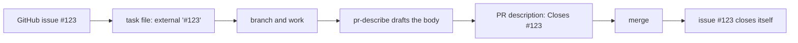

# Linking tasks to GitHub issues

How to connect the kit's local `.tasks/` system to a GitHub issue tracker, so work stays visible to a team without giving up what makes the local system work.

The behavioral contract behind this is [`docs/spec/tracker-links.md`](spec/tracker-links.md). This guide is the practical version.

## What this is for

The kit's work tracking is deliberately local. A task file lives in your repository, next to the code it changes, which is what keeps an agent's reading list short and lets the whole system work with no network and no account.

The cost is visibility. Someone planning a sprint, assigning work, or reporting progress works in a tracker, and a task file in your repository is invisible to them.

This feature closes that gap in one direction only: a task can name the GitHub issue it serves, and when the pull request that completes it merges, the issue closes by itself.



## How to use it

### 1. Add the reference to the task file

Put an `external` field in the task's frontmatter, holding the issue reference in GitHub's own syntax:

```yaml
external: "#123"
```

For an issue in a different repository, use the full form:

```yaml
external: "owner/repo#123"
```

Those two forms are the only ones accepted. A bare number is rejected on purpose, and the reason is worth knowing: storing the value exactly as GitHub expects it means the reference is emitted by concatenation rather than translation, so there is no parsing step that can quietly get it wrong.

### 2. Check it

```bash
python .tasks/validate.py --strict
```

A malformed reference is an **error**, not a warning. That is deliberate. The value ends up verbatim in a pull request description, and a form GitHub does not recognise is ignored silently: no error, no warning, just an issue that never closes. Catching it here is the only place it is cheap.

### 3. Let `pr-describe` write the body

When you draft the pull request with `pr-describe`, it finds the linked task and puts a closing reference in the description:

```
Closes #123
```

Merge the pull request and GitHub closes the issue.

## The four rules that make this work

The plumbing is one line of text. The reason it needed a written contract is that GitHub's rules around that line fail **silently** in four different ways. Each one produces a pull request that looks correct, merges cleanly, and leaves your tracker wrong.

| Rule | What happens if you get it wrong |
|---|---|
| The reference goes in the **description**, never the title | A keyword in the title is ignored. Comments are ignored too. |
| **Repeat the keyword for every issue** | `Closes #1, #2, #3` closes only `#1`. The other two stay open. |
| The pull request must target the **default branch** | Against any other branch the keyword is inert. No link, no close. |
| A task moved to `.tasks/done/` **still counts** | Miss it and the most common case, a branch that completes its own task, emits nothing. |

`pr-describe` knows all four. When the pull request targets a non-default branch it emits the bare reference with **no** keyword and says why, because an inert keyword is worse than none: it reads as done and does nothing.

## What it deliberately does not do

- **It never touches GitHub.** `pr-describe` drafts text. It does not create, edit, close, or assign anything, and it makes no network call. That is a settled design decision, not an omission.
- **It never reads issue state back.** The task file is the source of truth. Nothing syncs in the other direction, so there is no second writable copy to diverge from.
- **It does not check that the issue exists.** That would require the network call the skill exists without.
- **It does not mirror task files into issues**, manage sub-issues, set issue types, or assign anyone.

If you want an issue's content to become a task, that is `new-task`'s job, with a human in the loop. An issue is an **input** to task authoring, not a substitute for a task file: the fields that make a task useful to an agent (honest `touched_files`, a mechanically verifiable acceptance command) are not things anyone types into an issue box.

## Which altitude to link at

You can link at any level, but the useful default is coarser than people expect.

A sprint board wants five to fifteen items a human can reason about. It does not want fifty atomic agent tasks. So in most teams the issue maps to a **roadmap Feature**, a person is assigned that, and the Feature is decomposed locally into task files that never appear on the board at all. Assignment happens at the human altitude; execution happens at the agent altitude.

Link individual tasks to individual issues when you actually want that granularity on the board, not by default.

## Troubleshooting

### The pull request merged but the issue is still open

Check, in this order:

1. **Was the reference in the description?** Not the title, not a comment.
2. **Did the pull request target the default branch?** This is the most common cause. GitHub ignores closing keywords entirely otherwise.
3. **Was there one keyword per issue?** A shared keyword across a list closes only the first.
4. **Is the reference well formed?** `#123` or `owner/repo#123`. Run `python .tasks/validate.py --strict`.

### The validator rejects my reference

It accepts exactly `#123` and `owner/repo#123`. A bare `123`, a URL, or a title with the number in it are all rejected by design.

### I want the link without the close

Use the reference without a keyword. GitHub still shows the connection; nothing closes on merge.

## Other trackers

Azure Boards uses the same shape with a different token (`AB#1234`, and `Fixed AB#1234` to transition state). The `external` field stores whatever the platform's own syntax is, verbatim, so it will hold an Azure reference with no new field and no translation layer.

Support for it is on the [roadmap](../ROADMAP.md), deliberately unbuilt until there is a real board to exercise it against. Shipping an integration nobody has run is the one thing this project's [contribution bar](../CONTRIBUTING.md) refuses.
